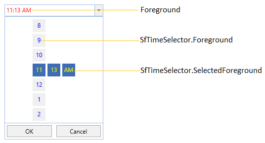
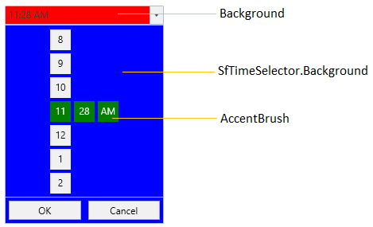
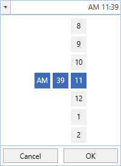

# Appearance and Styling in WPF SfTimePicker

This section explains different UI customization, styling, theming options available in [SfTimePicker](https://help.syncfusion.com/cr/wpf/Syncfusion.Windows.Controls.Input.SfTimePicker.html) control.

## Setting the Foreground

We can change a foreground of the `SfTimePicker` by using the `Foreground` property and also we can change the [SfTimeSelector](https://help.syncfusion.com/cr/wpf/Syncfusion.Windows.Controls.Input.SfTimeSelector.html) items and selected time item foreground by using the `Foreground` and [SfTimeSelector.SelectedForeground](https://help.syncfusion.com/cr/wpf/Syncfusion.Windows.Controls.Input.SfTimeSelector.html#Syncfusion_Windows_Controls_Input_SfTimeSelector_SelectedForeground) properties of `SfTimeSelector`.



<syncfusion:SfTimePicker Name="sfTimePicker"
                         Foreground="Red"
                         Width="200">
    <syncfusion:SfTimePicker.SelectorStyle>
        
    </syncfusion:SfTimePicker.SelectorStyle>
</syncfusion:SfTimePicker>



## Setting the Background

We can change a background of the `SfTimePicker` by using the `background` property and also we can change the [SfTimeSelector](https://help.syncfusion.com/cr/wpf/Syncfusion.Windows.Controls.Input.SfTimeSelector.html) items and selected time item background by using the `Background` and [SfTimeSelector.AccentBrush](https://help.syncfusion.com/cr/wpf/Syncfusion.Windows.Controls.Input.SfTimePicker.html#Syncfusion_Windows_Controls_Input_SfTimePicker_AccentBrush) properties of `SfTimeSelector`.



<syncfusion:SfTimePicker Name="sfTimePicker"
                         Background="Red"
                         AccentBrush="Green"
                 Width="200">
    <syncfusion:SfTimePicker.SelectorStyle>
        
    </syncfusion:SfTimePicker.SelectorStyle>
</syncfusion:SfTimePicker>



## Change flow direction

We can change the flow direction of the `SfTimePicker` control from right to left by setting the `FlowDirection` property value as `RightToLeft`. The Default value of `FlowDirection` property is `LeftToRight`.




<syncfusion:SfTimePicker FlowDirection="RightToLeft" Name="sfTimePicker"/>




SfTimePicker sfTimePicker= new SfTimePicker();
sfTimePicker.FlowDirection = FlowDirection.RightToLeft;




Click [here](https://github.com/SyncfusionExamples/wpf-time-picker-examples/tree/master/Samples/Apperance) to download the sample that showcases the different UI customization and styling supports.