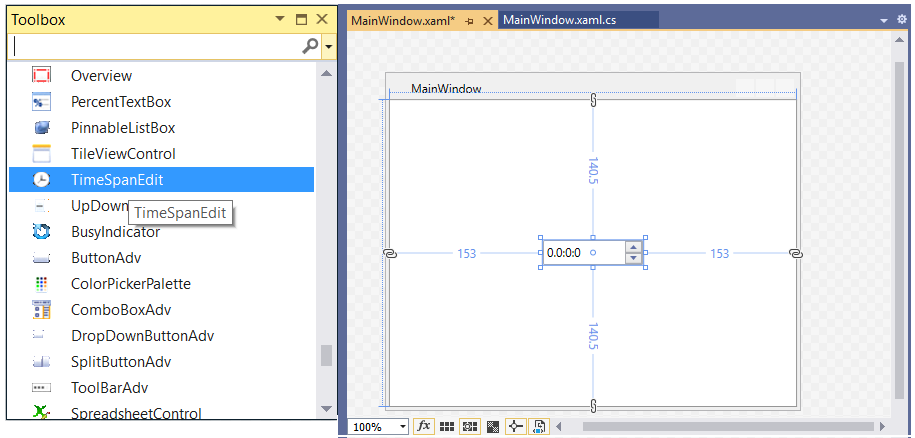

# Getting started with WPF TimeSpanEdit

This section explains how to create a WPF [TimeSpanEdit](https://help.syncfusion.com/cr/wpf/Syncfusion.Shared.Wpf~Syncfusion.Windows.Tools.Controls.TimeSpanEdit.html) and explains about its structure and features.

## Control Structure

## Assembly deployment

Refer to the [control dependencies](https://help.syncfusion.com/wpf/control-dependencies#timespanedit) section to get the list of assemblies or NuGet package that needs to be added as reference to use the control in any application.

You can find more details about installing the NuGet package in a WPF application in the following link: 

[How to install nuget packages](https://help.syncfusion.com/wpf/nuget-packages)

## Adding WPF TimeSpanEdit via designer

You can add the `TimeSpanEdit` control to an application by dragging it from the toolbox to a view of the designer. The following dependent assembly will be added automatically.

* Syncfusion.Shared.WPF

 
 
## Adding WPF TimeSpanEdit via XAML

To add the `TimeSpanEdit` control manually in XAML, follow these steps:
1. Create a new WPF project in Visual Studio.

2. Add the  following assembly references to the project,
   * Syncfusion.Shared.WPF
 
3. Import Syncfusion WPF schema **http://schemas.syncfusion.com/wpf** and declare the `TimeSpanEdit` control in XAML page.

4.	Declare the `TimeSpanEdit` control in XAML page.




<Window xmlns="http://schemas.microsoft.com/winfx/2006/xaml/presentation"
        xmlns:x="http://schemas.microsoft.com/winfx/2006/xaml"
        xmlns:syncfusion="http://schemas.syncfusion.com/wpf" 
        x:Class="TimeSpanEditSample.MainWindow"
        Title="TimeSpanEdit Sample" Height="350" Width="525">
    <Grid>
        <!--Adding TimeSpanEdit control -->
        <syncfusion:TimeSpanEdit x:Name="timeSpanEdit" 
                                       Width="100" 
                                       Height="25" />
    </Grid>
</Window>



## Adding WPF TimeSpanEdit via C\#

To add the `TimeSpanEdit` control manually in C#, follow these steps:

1. Create a new WPF application via Visual Studio.

2. Add the  following assembly references to the project,
    * Syncfusion.Shared.WPF

3. Include the required namespace and create an instance of `TimeSpanEdit` and add it to the window.

4.	Declare the `TimeSpanEdit` control using C#.




using Syncfusion.Windows.Tools.Controls;

public partial class MainWindow : Window {
    public MainWindow() {
        InitializeComponent();

        //Creating an instance of TimeSpanEdit control
        TimeSpanEdit timeSpanEdit = new timeSpanEdit();
        timeSpanEdit.Width = 100;
        timeSpanEdit.Height = 25;        

        //Adding TimeSpanEdit as window content
        this.Content = timeSpanEdit;
    }
}




