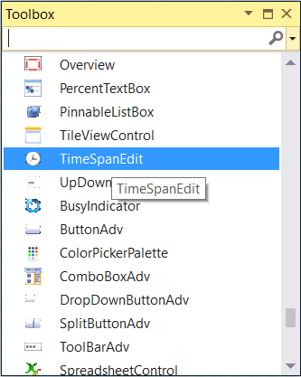
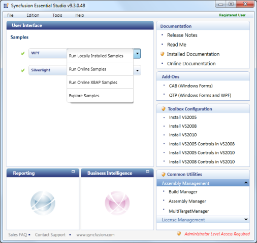

# Getting started

This section describes how to design a `TimeSpanEdit` control in a WPF Forms application and overview of its basic functionalities.

* Adding TimeSpanEdit control 
* Structure of the TimeSpanEdit control
* Appearance 
* Properties  
* Events 

## Assembly deployment

The below assembly should be added as references to use the TimeSpanEdit Control in application:

<table>
<tr>
<td>
{{'**Required assembly**'| markdownify }}
</td>
<td>
{{'**Description**'| markdownify }}
</td>
</tr>
<tr>
<td>
Syncfusion.Shared.WPF
</td>
<td>
The Syncfusion.Shared.WPF contains the class that handles all UI operations and contains helper class of TimeSpanEdit control.
</td>
</tr>
</table>

# Creating simple application with TimeSpanEdit

You can create the Windows Forms application with TimeSpanEdit control as follows:

1. [Creating project](#creating-the-project)
2. [Adding control via Designer](#adding-control-via-designer)
3. [Adding control manually in code](#adding-control-manually-in-code)

### Creating the project

Create a new WPF project in the Visual Studio to display the TimeSpanEdit with time information.

## Adding control via designer

The `TimeSpanEdit` control can be added to the application by dragging it from the toolbox and dropping it in a designer view. The following assembly references will be added automatically:

* Syncfusion.Shared.WPF.dll

 

## Adding control manually in code

To add control manually in C#, follow the given steps:

1. Add the following required assembly references to the project:
	* Syncfusion.Shared.WPF.dll

2. Include the namespace `Syncfusion.Windows.Shared`





using Syncfusion.Windows.Shared;





3. Create `TimeSpanEdit` control instance and add it to the Window.





//Create the instance of TimeSpanEdit

TimeSpanEdit timespan = new TimeSpanEdit();

timespan.Width = 150;

timespan.Height = 30;

timespan.VerticalAlignment = VerticalAlignment.Top;

//Adding control to the window

this.Content = timespan; 



## Structure of the TimeSpanEdit control 

## Styling

The UI of TimeSpanEdit can be changed using different Styles.

### Visual Styles

`SkinManager` provides rich and professional look and feel UI for the TimeSpanEdit Control. Some of the available visual styles are as follows:

* Blend
* Office2007Blue
* Office2007Black
* Office2007Silver
* Office2010Blue
* Office2010Black
* Office2010Silver
* VS2010
* Metro
* Transparent

The visual style can be applied for the TimeSpanEdit using the `VisualStyle` property of the `SkinStorage`.





<!--TimeSpanEdit Visual Style -->
<syncfusion:TimeSpanEdit x:Name="Tiem1"  Width="200" Height="23"  Value="10.2:25:52"  syncfusion:SkinStorage.VisualStyle="Metro" />




//Set Visual Style
SkinStorage.SetVisualStyle(timespan,"Blend");





'Set Visual Style
SkinStorage.SetVisualStyle(timespan,"Blend")





**Blend Theme**

**Office2007Blue Theme**

**Office2007Black Theme**

**Office2007Silver Theme**

**Office2010Blue Theme**

**Office2010Black Theme**

**Office2010Silver Theme**

**VS2010 Theme**

**Metro Theme**

**Transparent Theme**

## Properties

<table>
<tr>
<th>
Properties</th><th>
Description</th><th>
Type Of Property</th><th>
Acceptable Value</th></tr>
<tr>
<td>
MaxValue</td><td>
Gets or sets the maximum value that can be accepted by the control</td><td>
TimeSpan</td><td>
Any value of type TimeSpan</td></tr>
<tr>
<td>
MinValue</td><td>
Gets or sets the minimum value that can be accepted by the control</td><td>
TimeSpan</td><td>
Any Value of type TimeSpan</td></tr>
<tr>
<td>
AllowNull</td><td>
Gets or sets a value indicating whether the control can accept the null value</td><td>
bool</td><td>
True/False</td></tr>
<tr>
<td>
NullString</td><td>
Gets or sets a value that will be displayed when the value is null</td><td>
string</td><td>
Any string</td></tr>
<tr>
<td>
Value</td><td>
Gets or sets the value of the control</td><td>
TimeSpan</td><td>
Any value of type TimeSpan</td></tr>
<tr>
<td>
ShowArrowButtons</td><td>
Gets or Sets a value whether the up down button can be visible</td><td>
bool</td><td>
True/False</td></tr>
<tr>
<td>
IncrementOnScrolling</td><td>
Gets or sets a value indicating whether to increment or decrement the selected option</td><td>
bool</td><td>
True/False</td></tr>
<tr>
<td>
Format</td><td>
Gets or sets the custom format strings. The word given between single quotes is displayed as it is. But the following tokens are replaced with values in the custom format string. d – replaced with days value , h – replaced with hours value , m – replaced with minutes value, s – replaced with seconds value , z- replaced with milliseconds valueExample :The following format string : d ‘Days’ h ‘Hours’ m ‘Minutes’Displayed as : 10 Days 20 Hours 30 Minutes</td><td>
string</td><td>
Any string</td></tr>
</table>

## Events

<table>
<tr>
<th>
Event</th><th>
Description</th><th>
Argument</th><th>
Type</th></tr>
<tr>
<td>
ValueChanged</td><td>
This event is fired when the value of the control is changed</td><td>
Value</td><td>
PropertyChangedCallback</td></tr>
</table>

##  Samples link

To view samples:

1. Click Start-->All Programs-->Syncfusion-->Essential Studio <XX.X.X.XX> -->Dashboard.

   The Essential Studio Enterprise Edition window is displayed. 

   

The User Interface edition panel is displayed by default. 

1. Select WPF from the samples listed. The following options will be displayed. You can view the samples in the following three ways:
1. Run Locally Installed Samples-View the locally installed Tools samples for WPF using the sample browser
2. Run Online Samples-View the online samples for WPF
3. Run Online XBAP Samples – View the online XBAP samples  for WPF
4. Explore Samples-Locate the WPF samples on the disk

   

5. Select Run Locally Installed Samples. The WPF Sample Browser displays.

   

6. On the left pane, go to Editor Controls ->Time Span Edit Demo.
