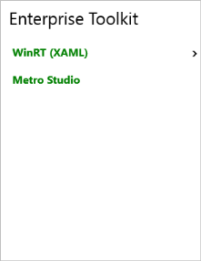

# Populating Items in WPF Tree Navigator (SfTreeNavigator)s

## Items source 

[Tree Navigator items](https://help.syncfusion.com/cr/wpf/Syncfusion.SfTreeNavigator.WPF~Syncfusion.Windows.Controls.Navigation.SfTreeNavigatorItem.html) can be populated with the business object collection. Let us create a [Tree Navigator](https://help.syncfusion.com/cr/wpf/Syncfusion.SfTreeNavigator.WPF~Syncfusion.Windows.Controls.Navigation.SfTreeNavigator.html) which will show the list of Syncfusion Enterprise Toolkit products.  

Create a Model class with the necessary properties. 




public class TreeModel : NotificationObject
{
    public TreeModel()
    {
        Models = new ObservableCollection<TreeModel>();
    }
    private string header;
    public string Header
    {
        get { return header; }
        set
        {
            header = value;
            RaisePropertyChanged("Header");
        }
    }
    private ObservableCollection<TreeModel> models;
    public ObservableCollection<TreeModel> Models
    {
        get { return models; }
        set { models = value; }
    }
}



N> NotificationObject is a class which implements INotifyPropertyChanged interface.

Create a View Model class with the hierarchical items as follows.  




public class TreeViewModel 
{
    private List<TreeModel> models;
    public List<TreeModel> Models
    {
        get { return models; }
        set { models = value; }
    }
    public TreeViewModel()
    {
        Models = new List<TreeModel>();
        TreeModel winrt = new TreeModel() {Header = "WinRT (XAML)"};
        TreeModel metroStudio = new TreeModel() {Header = "Metro Studio"};
        TreeModel winrt_chart = new TreeModel() {Header = "Chart"};
        TreeModel winrt_tools = new TreeModel() {Header = "Tools"};

        winrt.Models.Add(winrt_chart);
        winrt.Models.Add(winrt_tools);

        Models.Add(winrt);
        Models.Add(metroStudio);
    }
}



 Bind the Models collection to the ItemsSource property of the [Tree Navigator](https://help.syncfusion.com/cr/wpf/Syncfusion.SfTreeNavigator.WPF~Syncfusion.Windows.Controls.Navigation.SfTreeNavigator.html) control as follows. 




<navigation:SfTreeNavigator ItemsSource="{Binding Models}"  
                            Header="Enterprise Toolkit"
                            Width="300" Height="400"
                            HorizontalAlignment="Center"
                            VerticalAlignment="Center" />




 This will populate the [Tree Navigator](https://help.syncfusion.com/cr/wpf/Syncfusion.SfTreeNavigator.WPF~Syncfusion.Windows.Controls.Navigation.SfTreeNavigator.html) as shown below. 

## Item template 

ItemTemplate property of the [Tree Navigator](https://help.syncfusion.com/cr/wpf/Syncfusion.SfTreeNavigator.WPF~Syncfusion.Windows.Controls.Navigation.SfTreeNavigator.html) can be used to customize the display of business objects. 




<navigation:SfTreeNavigator ItemsSource="{Binding Models}"  
                                    Header="Enterprise Toolkit"
                                    Width="300" Height="400"
                                    HorizontalAlignment="Center"
                                    VerticalAlignment="Center"
                                    >
<navigation:SfTreeNavigator.ItemTemplate>
<HierarchicalDataTemplate ItemsSource="{Binding Models}">
<StackPanel Orientation="Horizontal">
<TextBlock Text="{Binding Header}" 
        Foreground="Green" FontWeight="Bold" 
        VerticalAlignment="Center" Margin="18 0 0 0"/>
</StackPanel>
</HierarchicalDataTemplate>
</navigation:SfTreeNavigator.ItemTemplate>
</navigation:SfTreeNavigator>



This will populate the [Tree Navigator](https://help.syncfusion.com/cr/wpf/Syncfusion.SfTreeNavigator.WPF~Syncfusion.Windows.Controls.Navigation.SfTreeNavigator.html) as follows.

## See Also

[How to enable/disable menu items in WPF SfTreeNavigator using MVVM?](https://www.syncfusion.com/forums/153051/enable-disable-items-in-sftreenavigator)

