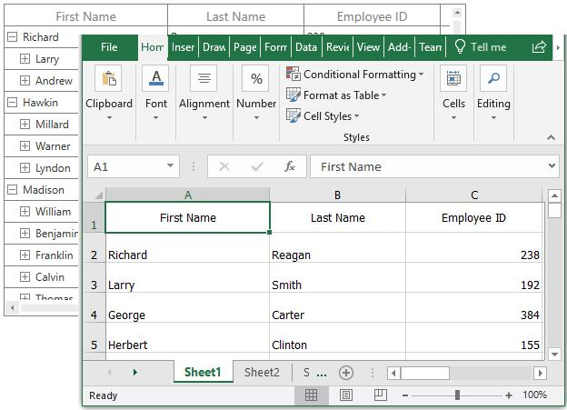
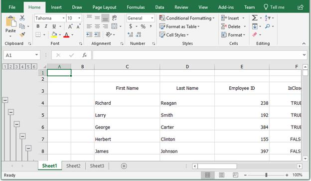
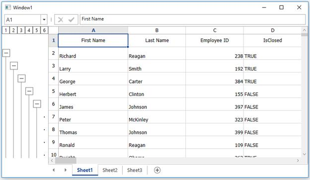
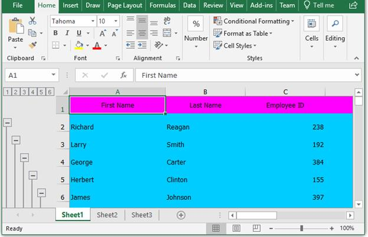
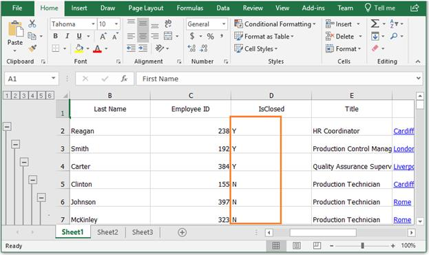
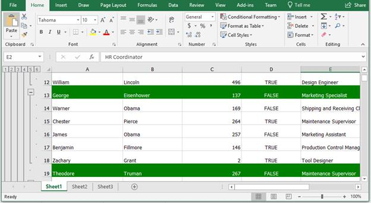
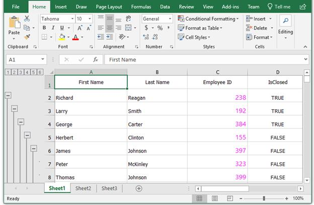
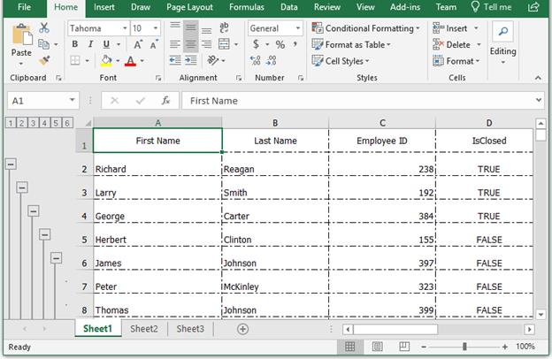
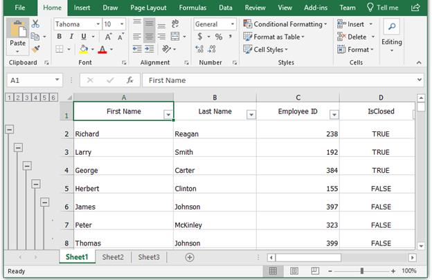
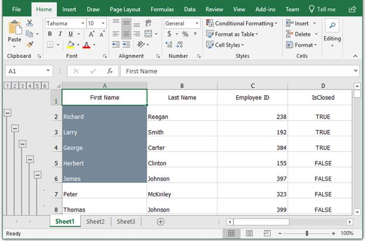

# Export to Excel

SfTreeGrid provides support to export the data to Excel file. This also provides support to export the headers and stacked headers. This maintains the sorting and filtering processes when exporting.

The following assemblies should be added for exporting a tree grid to Excel:-

* Syncfusion.SfGridConverter.WPF
* Syncfusion.XlsIO.Base
* Syncfusion.XlsIO.Wpf

You can export the tree grid to Excel by using the [ExportToExcel](https://help.syncfusion.com/cr/wpf/Syncfusion.UI.Xaml.TreeGrid.Converter.TreeGridExcelExportExtension.html#Syncfusion_UI_Xaml_TreeGrid_Converter_TreeGridExcelExportExtension_ExportToExcel_Syncfusion_UI_Xaml_TreeGrid_SfTreeGrid_Syncfusion_UI_Xaml_TreeGrid_Converter_TreeGridExcelExportingOptions_) extension method present in [Syncfusion.UI.Xaml.TreeGrid.Converter](http://help.syncfusion.com/cr/cref_files/wpf/webtoc.html) namespace.



using Syncfusion.UI.Xaml.TreeGrid.Converter;
var options = new TreeGridExcelExportingOptions();
options.ExcelVersion = ExcelVersion.Excel2013;
var excelEngine = treeGrid.ExportToExcel(options);
var workBook = excelEngine.Excel.Workbooks[0];
workBook.SaveAs("Sample.xlsx");



N> SfTreeGrid exports the data to Excel using [XlsIO](https://help.syncfusion.com/file-formats/xlsio/overview). You can refer to the [XlsIO documentation](https://help.syncfusion.com/file-formats/xlsio/working-with-excel-worksheet) for manipulating the exported work sheets.

## Export options

The exporting operation can be customized by passing [TreeGridExcelExportingOptions](https://help.syncfusion.com/cr/wpf/Syncfusion.UI.Xaml.TreeGrid.Converter.TreeGridExcelExportingOptions.html) instance as an argument to the [ExportToExcel](https://help.syncfusion.com/cr/wpf/Syncfusion.UI.Xaml.TreeGrid.Converter.TreeGridExcelExportExtension.html#Syncfusion_UI_Xaml_TreeGrid_Converter_TreeGridExcelExportExtension_ExportToExcel_Syncfusion_UI_Xaml_TreeGrid_SfTreeGrid_Syncfusion_UI_Xaml_TreeGrid_Converter_TreeGridExcelExportingOptions_) method.

### Change export mode

By default, the actual value will only be exported to Excel. To export the display text, set the [TreeGridExportMode](https://help.syncfusion.com/cr/wpf/Syncfusion.UI.Xaml.TreeGrid.Converter.TreeGridExcelExportingOptions.html#Syncfusion_UI_Xaml_TreeGrid_Converter_TreeGridExcelExportingOptions_TreeGridExportMode) property as `Text`.



var options = new TreeGridExcelExportingOptions();
options.ExcelVersion = ExcelVersion.Excel2013;
options.TreeGridExportMode = TreeGridExportMode.Text;
var excelEngine = treeGrid.ExportToExcel(options);
var workBook = excelEngine.Excel.Workbooks[0];
workBook.SaveAs("Sample.xlsx");



### Export without outlines	

By default, all the children in the tree grid will be exported in expanded state. You can disable the outlines in Excel by setting the [AllowOutliningGroups](https://help.syncfusion.com/cr/wpf/Syncfusion.UI.Xaml.TreeGrid.Converter.TreeGridExcelExportingOptions.html#Syncfusion_UI_Xaml_TreeGrid_Converter_TreeGridExcelExportingOptions_AllowOutliningGroups) property to false in [TreeGridExcelExportingOptions](https://help.syncfusion.com/cr/wpf/Syncfusion.UI.Xaml.TreeGrid.Converter.TreeGridExcelExportingOptions.html) class.



var options = new TreeGridExcelExportingOptions();
options.ExcelVersion = ExcelVersion.Excel2013;
options.AllowOutliningGroups = false;
var excelEngine = treeGrid.ExportToExcel(options);
var workBook = excelEngine.Excel.Workbooks[0];
workBook.SaveAs("Sample.xlsx");



### Exclude columns when exporting

By default, all the columns (including hidden columns) in the tree grid will be exported to Excel. To exclude some columns, use [ExcludeColumns](https://help.syncfusion.com/cr/wpf/Syncfusion.UI.Xaml.TreeGrid.Converter.TreeGridExcelExportingOptions.html#Syncfusion_UI_Xaml_TreeGrid_Converter_TreeGridExcelExportingOptions_ExcludeColumns) field in [TreeGridExcelExportingOptions](https://help.syncfusion.com/cr/wpf/Syncfusion.UI.Xaml.TreeGrid.Converter.TreeGridExcelExportingOptions.html) class.



var options = new TreeGridExcelExportingOptions();
options.ExcelVersion = ExcelVersion.Excel2013;
options.ExcludeColumns.Add("FirstName");
options.ExcludeColumns.Add("LastName");
var excelEngine = treeGrid.ExportToExcel(options);
var workBook = excelEngine.Excel.Workbooks[0];
workBook.SaveAs("Sample.xlsx");



Here, the columns having FirstName and LastName as MappingName are excluded when exporting.

### Excel version

When exporting to Excel, you can specify the Excel version by using the [ExcelVersion](https://help.syncfusion.com/cr/wpf/Syncfusion.UI.Xaml.TreeGrid.Converter.TreeGridExcelExportingOptions.html#Syncfusion_UI_Xaml_TreeGrid_Converter_TreeGridExcelExportingOptions_ExcelVersion) property.



var options = new TreeGridExcelExportingOptions();
options.ExcelVersion = ExcelVersion.Excel2013;
var excelEngine = treeGrid.ExportToExcel(options);
var workBook = excelEngine.Excel.Workbooks[0];
workBook.SaveAs("Sample.xlsx");



### Export stacked headers to Excel

You can export the stacked headers to Excel by setting the [ExportStackedHeaders](https://help.syncfusion.com/cr/wpf/Syncfusion.UI.Xaml.TreeGrid.Converter.TreeGridExcelExportingOptions.html#Syncfusion_UI_Xaml_TreeGrid_Converter_TreeGridExcelExportingOptions_ExportStackedHeaders) property to `true`.



var options = new TreeGridExcelExportingOptions();
options.ExcelVersion = ExcelVersion.Excel2013;
options.ExportStackedHeaders = true;
var excelEngine = treeGrid.ExportToExcel(options);
var workBook = excelEngine.Excel.Workbooks[0];
workBook.SaveAs("Sample.xlsx");



### Export hyper-link to Excel

You can export the hyper-link to Excel by setting the [CanExportHyperLink](https://help.syncfusion.com/cr/wpf/Syncfusion.UI.Xaml.TreeGrid.Converter.TreeGridExcelExportingOptions.html#Syncfusion_UI_Xaml_TreeGrid_Converter_TreeGridExcelExportingOptions_CanExportHyperLink) property to `true`.



var options =new TreeGridExcelExportingOptions();
options.ExcelVersion = ExcelVersion.Excel2013;
options.CanExportHyperLink = true;
var excelEngine = treeGrid.ExportToExcel(options);
var workBook = excelEngine.Excel.Workbooks[0];
workBook.SaveAs("Sample.xlsx");



The default value of the [CanExportHyperLink](https://help.syncfusion.com/cr/wpf/Syncfusion.UI.Xaml.TreeGrid.Converter.TreeGridExcelExportingOptions.html#Syncfusion_UI_Xaml_TreeGrid_Converter_TreeGridExcelExportingOptions_CanExportHyperLink) property is `true`.

### Export column width to Excel

You can export the columns with its actual width by setting the [ExportColumnWidth](https://help.syncfusion.com/cr/wpf/Syncfusion.UI.Xaml.TreeGrid.Converter.TreeGridExcelExportingOptions.html#Syncfusion_UI_Xaml_TreeGrid_Converter_TreeGridExcelExportingOptions_ExportColumnWidth) property to `true`. 



var options =new TreeGridExcelExportingOptions();
options.ExcelVersion = ExcelVersion.Excel2013;
options.ExportColumnWidth = true;
var excelEngine = treeGrid.ExportToExcel(options);
var workBook = excelEngine.Excel.Workbooks[0];
workBook.SaveAs("Sample.xlsx");



The default value of the [ExportColumnWidth](https://help.syncfusion.com/cr/wpf/Syncfusion.UI.Xaml.TreeGrid.Converter.TreeGridExcelExportingOptions.html#Syncfusion_UI_Xaml_TreeGrid_Converter_TreeGridExcelExportingOptions_ExportColumnWidth) property is `true`.

### Export with customized row height

You can export the tree grid to Excel with customized row height by using the [DefaultRowHeight](https://help.syncfusion.com/cr/wpf/Syncfusion.UI.Xaml.TreeGrid.Converter.TreeGridExcelExportingOptions.html#Syncfusion_UI_Xaml_TreeGrid_Converter_TreeGridExcelExportingOptions_DefaultRowHeight) property.



var options =new TreeGridExcelExportingOptions();
options.ExcelVersion = ExcelVersion.Excel2013;
options.DefaultRowHeight = 60;
var excelEngine = treeGrid.ExportToExcel(options);
var workBook = excelEngine.Excel.Workbooks[0];
workBook.SaveAs("Sample1.xlsx");



### Export without grid lines

You can export the tree grid to Excel without grid lines by setting the [IsGridLinesVisible](https://help.syncfusion.com/cr/wpf/Syncfusion.UI.Xaml.TreeGrid.Converter.TreeGridExcelExportingOptions.html#Syncfusion_UI_Xaml_TreeGrid_Converter_TreeGridExcelExportingOptions_IsGridLinesVisible) property to `false`.



var options =new TreeGridExcelExportingOptions();
options.ExcelVersion = ExcelVersion.Excel2013;
options.IsGridLinesVisible = true;
var excelEngine = treeGrid.ExportToExcel(options);
var workBook = excelEngine.Excel.Workbooks[0];
workBook.SaveAs("Sample.xlsx");



The default value of the [IsGridLinesVisible](https://help.syncfusion.com/cr/wpf/Syncfusion.UI.Xaml.TreeGrid.Converter.TreeGridExcelExportingOptions.html#Syncfusion_UI_Xaml_TreeGrid_Converter_TreeGridExcelExportingOptions_IsGridLinesVisible) property is `true`.

### Export with indent column

You can export the tree grid to Excel with indent column to denote the nodes level by setting the [AllowIndentColumn](https://help.syncfusion.com/cr/wpf/Syncfusion.UI.Xaml.TreeGrid.Converter.TreeGridExcelExportingOptions.html#Syncfusion_UI_Xaml_TreeGrid_Converter_TreeGridExcelExportingOptions_AllowIndentColumn) property to true.



var options =new TreeGridExcelExportingOptions();
options.ExcelVersion = ExcelVersion.Excel2013;
options.AllowIndentColumn = true;
var excelEngine = treeGrid.ExportToExcel(options);
var workBook = excelEngine.Excel.Workbooks[0];
workBook.SaveAs("Sample1.xlsx");



The default value of the [AllowIndentColumn](https://help.syncfusion.com/cr/wpf/Syncfusion.UI.Xaml.TreeGrid.Converter.TreeGridExcelExportingOptions.html#Syncfusion_UI_Xaml_TreeGrid_Converter_TreeGridExcelExportingOptions_AllowIndentColumn) property is `false`.

### Change the node expand state in Excel

You can change the node expanding state in Excel by using the [NodeExpandMode](https://help.syncfusion.com/cr/wpf/Syncfusion.UI.Xaml.TreeGrid.Converter.TreeGridExcelExportingOptions.html#Syncfusion_UI_Xaml_TreeGrid_Converter_TreeGridExcelExportingOptions_NodeExpandMode) property.



var options =new TreeGridExcelExportingOptions();
options.ExcelVersion = ExcelVersion.Excel2013;
options.NodeExpandMode = NodeExpandMode.CollapseAll;
var excelEngine = treeGrid.ExportToExcel(options);
var workBook = excelEngine.Excel.Workbooks[0];
workBook.SaveAs("Sample.xlsx");



### Change start row and column index while exporting

You can export the data to a specified row and column index in the worksheet, by setting the [ExcelStartRowIndex ](https://help.syncfusion.com/cr/wpf/Syncfusion.UI.Xaml.TreeGrid.Converter.TreeGridExcelExportingOptions.html#Syncfusion_UI_Xaml_TreeGrid_Converter_TreeGridExcelExportingOptions_ExcelStartRowIndex) and [ExcelStartColumnIndex](https://help.syncfusion.com/cr/wpf/Syncfusion.UI.Xaml.TreeGrid.Converter.TreeGridExcelExportingOptions.html#Syncfusion_UI_Xaml_TreeGrid_Converter_TreeGridExcelExportingOptions_ExcelStartColumnIndex) properties.



var options = new TreeGridExcelExportingOptions();
options.ExcelVersion = ExcelVersion.Excel2013;
options.ExcelStartColumnIndex = 3;
options.ExcelStartRowIndex = 3;
var excelEngine = treeGrid.ExportToExcel(options);
var workBook = excelEngine.Excel.Workbooks[0];
workBook.SaveAs("Sample.xlsx");



## Save options

### Save Excel directory to file

After exporting to Excel, you can save the exported workbook directly to the file system using the [SaveAs](https://help.syncfusion.com/cr/wpf/Syncfusion.XlsIO.IWorkbook.html#Syncfusion_XlsIO_IWorkbook_SaveAs_System_IO_Stream_) method.



var options = new TreeGridExcelExportingOptions();
options.ExcelVersion = ExcelVersion.Excel2013;
var excelEngine = treeGrid.ExportToExcel(options);
var workBook = excelEngine.Excel.Workbooks[0];
workBook.SaveAs("Sample.xlsx");



### Save Excel to stream

After exporting to Excel, you can save the exported workbook to stream using the [SaveAs](https://help.syncfusion.com/cr/wpf/Syncfusion.XlsIO.IWorkbook.html#Syncfusion_XlsIO_IWorkbook_SaveAs_System_IO_Stream_) method.



var options = new TreeGridExcelExportingOptions();
options.ExcelVersion = ExcelVersion.Excel2013;
var excelEngine = treeGrid.ExportToExcel(options);
var workBook = excelEngine.Excel.Workbooks[0];
FileStream fileStream = new FileStream("Output.xlsx", FileMode.Create);
workBook.SaveAs(fileStream);



You can refer to the [XlsIO documentation](http://help.syncfusion.com/file-formats/xlsio/faq).

### Save Excel using File dialog

After exporting to Excel, you can save the exported workbook by opening the [FileDialog](https://msdn.microsoft.com/en-us/library/system.windows.forms.filedialog.aspx).



var options = new TreeGridExcelExportingOptions();
options.ExcelVersion = ExcelVersion.Excel2013;
var excelEngine = treeGrid.ExportToExcel(options);
var workBook = excelEngine.Excel.Workbooks[0];
SaveFileDialog sfd = new SaveFileDialog
{
    FilterIndex = 2,
    Filter = "Excel 97 to 2003 Files(*.xls)|*.xls|Excel 2007 to 2010 Files(*.xlsx)|*.xlsx|Excel 2013 File(*.xlsx)|*.xlsx"
};

if (sfd.ShowDialog() == true)
{
    using (Stream stream = sfd.OpenFile())
    {

        if (sfd.FilterIndex == 1)
            workBook.Version = ExcelVersion.Excel97to2003;

        else if (sfd.FilterIndex == 2)
            workBook.Version = ExcelVersion.Excel2010;

        else
            workBook.Version = ExcelVersion.Excel2013;
        workBook.SaveAs(stream);
    }

    //Message box confirmation to view the created workbook.

    if (MessageBox.Show("Do you want to view the workbook?", "Workbook has been created",
                        MessageBoxButton.YesNo, MessageBoxImage.Information) == MessageBoxResult.Yes)
    {

        //Launching the Excel file using the default Application.[MS Excel Or Free ExcelViewer]
        System.Diagnostics.Process.Start(sfd.FileName);
    }
}
}



### Open exported Excel without saving in disk

You can open the exported workbook without saving by using the [SfSpreadsheet](http://help.syncfusion.com/wpf/sfspreadsheet) control.



var options = new TreeGridExcelExportingOptions();
options.ExcelVersion = ExcelVersion.Excel2013;
var excelEngine = treeGrid.ExportToExcel(options);
var workBook = excelEngine.Excel.Workbooks[0];
Window1 window1 = new Window1();
SfSpreadsheet spreadsheet = new SfSpreadsheet();
spreadsheet.Open(workBook);
window1.Content = spreadsheet;
window1.Show();



## Export to HTML

You can save the exported workbook as HTML by using the [SaveAsHtml](https://help.syncfusion.com/cr/wpf/Syncfusion.XlsIO.IWorkbook.html#Syncfusion_XlsIO_IWorkbook_SaveAsHtml_System_IO_Stream_) method.



var options = new TreeGridExcelExportingOptions();
options.ExcelVersion = ExcelVersion.Excel2013;
options.AllowOutliningGroups = false;
var excelEngine = treeGrid.ExportToExcel(options);
var workBook = excelEngine.Excel.Workbooks[0];
workBook.SaveAsHtml("Sample.html", HtmlSaveOptions.Default);



It is also possible to save the worksheet as HTML by using the [SaveAsHtml](http://help.syncfusion.com/cr/cref_files/file-formats/Syncfusion.XlsIO.Base~Syncfusion.XlsIO.IWorkbook~SaveAsHtml.html) method. You can refer to[XlsIO documentation](http://help.syncfusion.com/file-formats/xlsio/working-with-excel-worksheet#save-worksheet-as-html).

## Export to mail

You can export the tree grid to mail by converting to Excel and save the exported worksheet as HTML. Then the exported HTML contents should be embedded in the mail body.



var options = new TreeGridExcelExportingOptions();
options.ExcelVersion = ExcelVersion.Excel2013;
var excelEngine = treeGrid.ExportToExcel(options);
var workBook = excelEngine.Excel.Workbooks[0];
workBook.Worksheets[0].UsedRange.BorderInside(ExcelLineStyle.Thick, ExcelKnownColors.Black);
    workBook.Worksheets[0].UsedRange.BorderAround(ExcelLineStyle.Thick, ExcelKnownColors.Black);
    workBook.Worksheets[0].SaveAsHtml("test.htm", Syncfusion.XlsIO.Implementation.HtmlSaveOptions.Default);

    System.Net.Mail.MailMessage myMessage = new System.Net.Mail.MailMessage();

    myMessage.To.Add("Support@syncfusion.com");
    myMessage.From = new MailAddress("Support@syncfusion.com");
    myMessage.Priority = MailPriority.High;
    myMessage.Subject = "Order Details";
    myMessage.IsBodyHtml = true;
    myMessage.Body = new StreamReader("test.htm").ReadToEnd();

    SmtpClient client = new SmtpClient("smtp.office365.com", 587);

    client.EnableSsl = true;
    client.UseDefaultCredentials = false;
    client.Credentials = new NetworkCredential("Support@syncfusion.com", "test");

    int count = 0;

    while (count < 3)
    {

        try
        {
            client.Send(myMessage);
            count = 3;
        }

        catch (Exception ex)
        {
            Console.WriteLine(ex.Message);
            Console.WriteLine(String.Format("Sending Mail Attemp - {0}", count.ToString()));
            Thread.Sleep(60000);
            count++;
        }
    }
    Console.WriteLine("Mail has been sent...");
}



## Export to XML

You can save the exported workbook as Xml file using the [SaveAsXml](https://help.syncfusion.com/cr/wpf/Syncfusion.XlsIO.IWorkbook.html#Syncfusion_XlsIO_IWorkbook_SaveAsXml_System_IO_Stream_Syncfusion_XlsIO_ExcelXmlSaveType_) method.



var options = new TreeGridExcelExportingOptions();
options.ExcelVersion = ExcelVersion.Excel2013;
var excelEngine = treeGrid.ExportToExcel(options);
var workBook = excelEngine.Excel.Workbooks[0];
workBook.SaveAsXml("Sample.xml", ExcelXmlSaveType.MSExcel);



## Export to CSV

You can save the exported workbook as CSV using the `SaveAs` method.



var options = new TreeGridExcelExportingOptions();
options.ExcelVersion = ExcelVersion.Excel2013;
var excelEngine = treeGrid.ExportToExcel(options);
var workBook = excelEngine.Excel.Workbooks[0];
workBook.SaveAs("Sample.csv", ",");



Similarly, you can also save the exported worksheet to CSV. Refer to the  [XlsIO documentation.](http://help.syncfusion.com/file-formats/xlsio/working-with-excel-worksheet#save-worksheet-as-csv)

## Customize row height and column width 

After exporting the data to Excel, you can set different row heights and column widths for the columns. You can refer to [here](http://help.syncfusion.com/file-formats/xlsio/worksheet-rows-and-columns-manipulation#adjust-row-height-and-column-width) for more information.



var options = new TreeGridExcelExportingOptions();
options.ExcelVersion = ExcelVersion.Excel2013;
var excelEngine = treeGrid.ExportToExcel(options);
var workBook = excelEngine.Excel.Workbooks[0];
workBook.Worksheets[0].SetRowHeight(2, 50);
workBook.Worksheets[0].SetColumnWidth(2, 50);
workBook.SaveAs("Sample.xlsx");



## Customize Cell appearance when exporting

You can customize the cells by setting the [ExportingEventHandler ](https://help.syncfusion.com/cr/wpf/Syncfusion.UI.Xaml.TreeGrid.Converter.TreeGridExcelExportingOptions.html#Syncfusion_UI_Xaml_TreeGrid_Converter_TreeGridExcelExportingOptions_ExportingEventHandler)in [TreeGridExcelExportingOptions](https://help.syncfusion.com/cr/wpf/Syncfusion.UI.Xaml.TreeGrid.Converter.TreeGridExcelExportingOptions.html).

### Cell styling cells based on cell type in Excel

You can customize the cell styles based on the cell type by using the [ExportingEventHandler](https://help.syncfusion.com/cr/wpf/Syncfusion.UI.Xaml.TreeGrid.Converter.TreeGridExcelExportingOptions.html#Syncfusion_UI_Xaml_TreeGrid_Converter_TreeGridExcelExportingOptions_ExportingEventHandler).



var options = new TreeGridExcelExportingOptions();
options.ExcelVersion = ExcelVersion.Excel2013;
options.ExportingEventHandler = ExportingHandler;
var excelEngine = treeGrid.ExportToExcel(options);
var workBook = excelEngine.Excel.Workbooks[0];
workBook.SaveAs("Sample.xlsx");

private static void ExportingHandler(object sender, TreeGridExcelExportingEventArgs e)
{
    if (e.CellType == TreeGridCellType.HeaderCell)
    {
        e.Style.ColorIndex = ExcelKnownColors.Pink;
        e.Handled = true;
    }

    else if (e.CellType == TreeGridCellType.RecordCell)
    {
        e.Style.ColorIndex = ExcelKnownColors.Sky_blue;
        e.Handled = true;
    }
}



### Customize the exporting content to Excel 

You can customize the cell values when exporting to Excel by using the [CellsExportingEventHandler](https://help.syncfusion.com/cr/wpf/Syncfusion.UI.Xaml.TreeGrid.Converter.TreeGridExcelExportingOptions.html#Syncfusion_UI_Xaml_TreeGrid_Converter_TreeGridExcelExportingOptions_CellsExportingEventHandler) in  [TreeGridExcelExportingOptions](https://help.syncfusion.com/cr/wpf/Syncfusion.UI.Xaml.TreeGrid.Converter.TreeGridExcelExportingOptions.html).



var options = new TreeGridExcelExportingOptions();
options.ExcelVersion = ExcelVersion.Excel2013;
options.CellsExportingEventHandler = CellExportingHandler;
var excelEngine = treeGrid.ExportToExcel(options);
var workBook = excelEngine.Excel.Workbooks[0];
workBook.SaveAs("Sample.xlsx");

private static void CellExportingHandler(object sender, TreeGridCellExcelExportingEventArgs e)
{
    // Based on the column mapping name and the cell type, we can change the cell 
    //values while exporting to excel.
    if (e.CellType == TreeGridCellType.RecordCell && e.ColumnName == "IsClosed")
    {
        //if the cell value is True, "Y" will be displayed else "N" will be displayed.

        if (e.CellValue.Equals(true))
            e.Range.Cells[0].Value = "Y";

        else
            e.Range.Cells[0].Value = "N";
        e.Handled = true;
    }
}



Here, the cell values changed for the IsClosed column are based on the custom condition.

### Change row style in Excel based on data

You can customize the rows based on the record values by using the [CellsExportingEventHandler](https://help.syncfusion.com/cr/wpf/Syncfusion.UI.Xaml.TreeGrid.Converter.TreeGridExcelExportingOptions.html#Syncfusion_UI_Xaml_TreeGrid_Converter_TreeGridExcelExportingOptions_CellsExportingEventHandler).



var options = new TreeGridExcelExportingOptions();
options.ExcelVersion = ExcelVersion.Excel2013;
options.CellsExportingEventHandler = CellExportingHandler;
var excelEngine = treeGrid.ExportToExcel(options);
var workBook = excelEngine.Excel.Workbooks[0];
workBook.SaveAs("Sample.xlsx");

private static void CellExportingHandler(object sender, TreeGridCellExcelExportingEventArgs e)
{
    if ((e.Node==null))
        return;
    var record = e.Node as EmployeeInfo;

    if (record.City == "NewYork")
    {
        e.Range.CellStyle.ColorIndex = ExcelKnownColors.Green;
        e.Range.CellStyle.Font.Color = ExcelKnownColors.White;
    }
}



### Customize the cells based on column name

You can customize the cells based on the [GridCellExcelExportingEventArgs.ColumnName](http://help.syncfusion.com/cr/cref_files/wpf/Syncfusion.SfGridConverter.WPF~Syncfusion.UI.Xaml.Grid.Converter.GridCellExcelExportingEventArgs~ColumnName.html) property in [CellsExportingEventHandler](https://help.syncfusion.com/cr/wpf/Syncfusion.UI.Xaml.TreeGrid.Converter.TreeGridExcelExportingOptions.html#Syncfusion_UI_Xaml_TreeGrid_Converter_TreeGridExcelExportingOptions_CellsExportingEventHandler).



var options = new TreeGridExcelExportingOptions();
options.ExcelVersion = ExcelVersion.Excel2013;
options.AllowOutliningGroups = false;
options.CellsExportingEventHandler = CellExportingHandler;
var excelEngine = treeGrid.ExportToExcel(options);
var workBook = excelEngine.Excel.Workbooks[0];
workBook.SaveAs("Sample.xlsx");

private static void CellExportingHandler(object sender, TreeGridCellExcelExportingEventArgs e)
{
    if (e.ColumnName != "ID")
        return;

    e.Range.CellStyle.Font.Size = 12;
    e.Range.CellStyle.Font.Color = ExcelKnownColors.Pink;
    e.Range.CellStyle.Font.FontName = "Segoe UI";
}



## Customize exported workbook and worksheet

The tree grid can be exported to Excel using [XlsIO](http://help.syncfusion.com/file-formats/xlsio/overview). You can refer to the [XlsIO documentation](http://help.syncfusion.com/file-formats/xlsio/working-with-excel-worksheet) for manipulating the workbooks and sheets after exporting.

### Set borders

You can set the borders to Excel cells by directly accessing worksheet after exporting the data.



var options = new TreeGridExcelExportingOptions();
options.ExcelVersion = ExcelVersion.Excel2013;
var excelEngine = treeGrid.ExportToExcel(options);
var workBook = excelEngine.Excel.Workbooks[0];
workBook.Worksheets[0].UsedRange.BorderInside(ExcelLineStyle.Dash_dot, ExcelKnownColors.Black);
workBook.Worksheets[0].UsedRange.BorderAround(ExcelLineStyle.Dash_dot, ExcelKnownColors.Black);
workBook.SaveAs("Sample.xlsx");



### Enable filters

You can show filters in the exported worksheet by enabling filter for the exported range.



var options = new TreeGridExcelExportingOptions();
options.ExcelVersion = ExcelVersion.Excel2013;
var excelEngine = treeGrid.ExportToExcel(options);
var workBook = excelEngine.Excel.Workbooks[0];
workBook.Worksheets[0].AutoFilters.FilterRange = workBook.Worksheets[0].UsedRange;
workBook.SaveAs("Sample.xlsx");



When using the `stacked headers`, you can specify the `range` based on the stacked headers count.



var options = new TreeGridExcelExportingOptions();
options.ExcelVersion = ExcelVersion.Excel2013;
var excelEngine = treeGrid.ExportToExcel(options);
var workBook = excelEngine.Excel.Workbooks[0];
var range = "A" + (treeGrid.StackedHeaderRows.Count + 1).ToString() + ":" + workBook.Worksheets[0].UsedRange.End.AddressLocal;
excelEngine.Excel.Workbooks[0].Worksheets[0].AutoFilters.FilterRange = workBook.Worksheets[0].Range[range];
workBook.SaveAs("Sample.xlsx");



You can refer to the [XlsIO documentation](http://help.syncfusion.com/file-formats/xlsio/worksheet-cells-manipulation#data-filtering).

### Customize the range of cells

You can customize the range of cells after exporting to Excel by directly manipulating the worksheet.



var options = new TreeGridExcelExportingOptions();
options.ExcelVersion = ExcelVersion.Excel2013;
var excelEngine = treeGrid.ExportToExcel(options);
var workBook = excelEngine.Excel.Workbooks[0];
workBook.Worksheets[0].Range["A2:A6"].CellStyle.Color = System.Drawing.Color.LightSlateGray;
workBook.Worksheets[0].Range["A2:A6"].CellStyle.Font.Color = ExcelKnownColors.White;
workBook.SaveAs("Sample.xlsx");



## Performance

Using the [ExcelExportingOptions.CellsExportingEventHandler](https://help.syncfusion.com/cr/wpf/Syncfusion.UI.Xaml.TreeGrid.Converter.TreeGridExcelExportingOptions.html#Syncfusion_UI_Xaml_TreeGrid_Converter_TreeGridExcelExportingOptions_CellsExportingEventHandler) and changing the settings for each cell will consume more memory and time. So, avoid using the `CellsExportingEventHandler` and instead of this, you can do the required settings in the exported sheet.

### Format column without using CellsExportingEventHandler

You can perform cell level customizations such as row-level styling, formatting a particular column in the exported worksheet.
In the following code snippet, NumberFormat for `Employee ID` column is changed in the exported sheet after exporting without using the [CellsExportingEventHandler](https://help.syncfusion.com/cr/wpf/Syncfusion.UI.Xaml.TreeGrid.Converter.TreeGridExcelExportingOptions.html#Syncfusion_UI_Xaml_TreeGrid_Converter_TreeGridExcelExportingOptions_CellsExportingEventHandler).

Reference:
[http://help.syncfusion.com/file-formats/xlsio/working-with-cell-or-range-formatting](http://help.syncfusion.com/file-formats/xlsio/working-with-cell-or-range-formatting)



var options = new TreeGridExcelExportingOptions();
options.TreeGridExportMode = TreeGridExportMode.Value;
options.ExcelVersion = ExcelVersion.Excel2013;
var excelEngine = treeGrid.ExportToExcel(options);
IWorkbook workBook = excelEngine.Excel.Workbooks[0];
workBook.ActiveSheet.Columns[2].NumberFormat = "0.0";
workBook.SaveAs("Sample.xlsx");



### Alternate row styling without using CellsExportingEventHandler

In the following code snippet, the background color of the rows in Excel is changed based on the row index using conditional formatting for better performance.

Reference:
[http://help.syncfusion.com/file-formats/xlsio/working-with-conditional-formatting](http://help.syncfusion.com/file-formats/xlsio/working-with-conditional-formatting)



var options = new TreeGridExcelExportingOptions();
options.TreeGridExportMode = TreeGridExportMode.Value;
options.ExcelVersion = ExcelVersion.Excel2013;
var excelEngine = treeGrid.ExportToExcel(options);
IWorkbook workBook = excelEngine.Excel.Workbooks[0];
IConditionalFormats condition = workBook.ActiveSheet.Range[2, 1, this.treeGrid.View.Nodes.Count + 1, this.treeGrid.Columns.Count].ConditionalFormats;
IConditionalFormat condition1 = condition.AddCondition();
condition1.FormatType = ExcelCFType.Formula;
condition1.FirstFormula = "MOD(ROW(),2)=0";
condition1.BackColorRGB = System.Drawing.Color.Pink;
IConditionalFormat condition2 = condition.AddCondition();
condition2.FormatType = ExcelCFType.Formula;
condition2.FirstFormula = "MOD(ROW(),2)=1";
condition2.BackColorRGB = System.Drawing.Color.LightGray;
workBook.SaveAs("Sample.xlsx");



## How to

### Export multiple tree grids to single Excel sheet

You can export multiple tree grids to single Excel sheet by merging one tree grid worksheet into another using the `Worksheet.UsedRange.CopyTo` method.



var options = new TreeGridExcelExportingOptions();
options.ExcelVersion = ExcelVersion.Excel2010;

var excelEngine = treeGrid.ExportToExcel(options);
var workBook1 = excelEngine.Excel.Workbooks[0];
var worksheet1 = workBook1.Worksheets[0];
            
excelEngine = treeGrid1.ExportToExcel(options);
var workBook2 = excelEngine.Excel.Workbooks[0];
var worksheet2 = workBook2.Worksheets[0];

var columnCount = this.treeGrid1.Columns.Count;
//Merge the One TreeGrid WorkSheet into the other TreeGrid WorkSheet
worksheet2.UsedRange.CopyTo(worksheet1[1, columnCount + 1]);
workBook1.SaveAs("sample.xlsx");



### Export the tree grid that is not loaded in view

You can export the tree grid that is not loaded in view by calling the ApplyTemplate() method before exporting.



var options = new TreeGridExcelExportingOptions();
options.ExcelVersion = ExcelVersion.Excel2010;
treeGrid1.ApplyTemplate();
var excelEngine = treeGrid1.ExportToExcel(options);
var workBook1 = excelEngine.Excel.Workbooks[0];
var worksheet1 = workBook1.Worksheets[0];
workBook1.SaveAs("sample.xlsx");



### Export parent and expanded child nodes

By default, all the tree grid nodes will be exported when calling the `ExportToExcel` method. You can export only the parent and expanded child nodes by overriding the[ExportNodesToExcel](https://help.syncfusion.com/cr/wpf/Syncfusion.UI.Xaml.TreeGrid.Converter.TreeGridToExcelConverter.html#Syncfusion_UI_Xaml_TreeGrid_Converter_TreeGridToExcelConverter_ExportNodesToExcel_Syncfusion_UI_Xaml_TreeGrid_SfTreeGrid_Syncfusion_UI_Xaml_TreeGrid_TreeNodes_Syncfusion_XlsIO_IWorksheet_Syncfusion_UI_Xaml_TreeGrid_Converter_TreeGridExcelExportingOptions_) method of [TreeGridToExcelConverter](https://help.syncfusion.com/cr/wpf/Syncfusion.UI.Xaml.TreeGrid.Converter.TreeGridToExcelConverter.html) class,



var options = new TreeGridExcelExportingOptions();
options.ExcelVersion = ExcelVersion.Excel2013;
var excelEngine = treeGrid.ExportToExcel(options, true);
var workBook = excelEngine.Excel.Workbooks[0];
workBook.SaveAs("Sample.xlsx");

protected override void ExportNodesToExcel(SfTreeGrid treeGrid, TreeNodes nodes, IWorksheet sheet, TreeGridExcelExportingOptions excelExportingOptions)
{
    if (!_excludeNonExpandedNodes)
    {
        base.ExportNodesToExcel(treeGrid, nodes, sheet, excelExportingOptions);
    }
    else
    {
        for (int i = 0; i < nodes.Count; i++)
        {
            TreeNode node = nodes[i];
            ExportNodeToExcel(treeGrid, node, sheet, excelExportingOptions);
            if (node.IsExpanded && node.HasChildNodes)
            {
                node.PopulateChildNodes();
                ExportNodesToExcel(treeGrid, node.ChildNodes, sheet, excelExportingOptions);
            }
        }
    }
}



You can download the sample [here](http://www.syncfusion.com/downloads/support/directtrac/general/ze/ExcelExportingDemo1880731953.zip).
