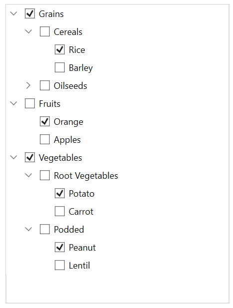

# TreeNode Checkbox in TreeView control

SfTreeView provides support for loading `CheckBox` in each node, and allows users to check/uncheck the corresponding node. So, you should add checkbox in the [ItemTemplate](https://help.syncfusion.com/cr/wpf/Syncfusion.SfTreeView.WPF~Syncfusion.UI.Xaml.TreeView.SfTreeView~ItemTemplate.html) of the `SfTreeView` and bind the [IsChecked](https://help.syncfusion.com/cr/wpf/Syncfusion.SfTreeView.WPF~Syncfusion.UI.Xaml.TreeView.Engine.TreeViewNode~IsChecked.html) property of the [TreeViewNode](https://help.syncfusion.com/cr/wpf/Syncfusion.SfTreeView.WPF~Syncfusion.UI.Xaml.TreeView.Engine.TreeViewNode.html).

## Working with Checkbox in UnboundMode

You can directly set the checkbox state by setting the [TreeViewNode.IsChecked](https://help.syncfusion.com/cr/wpf/Syncfusion.SfTreeView.WPF~Syncfusion.UI.Xaml.TreeView.Engine.TreeViewNode~IsChecked.html) property value while creating nodes.



<Window 
    x:Class="TreeNodeWithCheckBoxDemo.Window1"
    xmlns="http://schemas.microsoft.com/winfx/2006/xaml/presentation"
    xmlns:x="http://schemas.microsoft.com/winfx/2006/xaml"
    xmlns:local="clr-namespace:TreeNodeWithCheckBoxDemo"
    xmlns:syncfusion="http://schemas.syncfusion.com/wpf"
    xmlns:Engine="clr-namespace:Syncfusion.UI.Xaml.TreeView.Engine;assembly=Syncfusion.SfTreeView.WPF"
    Title="Node With CheckBox"
    Width="450"
    Height="500"
    Icon="App.ico"
    WindowStartupLocation="CenterScreen">
    <Grid>
        <syncfusion:SfTreeView x:Name="sfTreeView"
                                Width="400"
                                Margin="10,10,10,10"
                                BorderThickness="1"
                                BorderBrush="LightGray"
                                IsAnimationEnabled="True"
                                ItemTemplateDataContextType="Node" 
                                CheckBoxMode="Recursive" >
            <syncfusion:SfTreeView.Nodes>
                <Engine:TreeViewNode Content="Grains" IsExpanded="True" IsChecked="True">
                    <Engine:TreeViewNode.ChildNodes>
                        <Engine:TreeViewNode Content="Cereals" IsExpanded="True">
                            <Engine:TreeViewNode.ChildNodes>
                                <Engine:TreeViewNode Content="Rice" IsChecked="True"/>
                                <Engine:TreeViewNode Content="Barley"/>
                            </Engine:TreeViewNode.ChildNodes>
                        </Engine:TreeViewNode>
                        <Engine:TreeViewNode Content="Oilseeds">
                            <Engine:TreeViewNode.ChildNodes>
                                <Engine:TreeViewNode Content="Safflower" IsChecked="True"/>
                            </Engine:TreeViewNode.ChildNodes>
                        </Engine:TreeViewNode>
                    </Engine:TreeViewNode.ChildNodes>
                </Engine:TreeViewNode>
                <Engine:TreeViewNode Content="Fruits" IsExpanded="true">
                    <Engine:TreeViewNode.ChildNodes>
                        <Engine:TreeViewNode Content="Orange" IsChecked="True"/>
                        <Engine:TreeViewNode Content="Apples" IsExpanded="true"/>
                    </Engine:TreeViewNode.ChildNodes>
                </Engine:TreeViewNode>
                <Engine:TreeViewNode Content="Vegetables" IsExpanded="true" IsChecked="True">
                    <Engine:TreeViewNode.ChildNodes>
                        <Engine:TreeViewNode Content="Root Vegetables" IsExpanded="true">
                            <Engine:TreeViewNode.ChildNodes>
                                <Engine:TreeViewNode Content="Potato" IsChecked="True"/>
                                <Engine:TreeViewNode Content="Carrot"/>
                            </Engine:TreeViewNode.ChildNodes>
                        </Engine:TreeViewNode>
                        <Engine:TreeViewNode Content="Podded">
                            <Engine:TreeViewNode.ChildNodes>
                                <Engine:TreeViewNode Content="Peanut" IsChecked="True"/>
                                <Engine:TreeViewNode Content="Lentil"/>
                            </Engine:TreeViewNode.ChildNodes>
                        </Engine:TreeViewNode>
                    </Engine:TreeViewNode.ChildNodes>
                </Engine:TreeViewNode>
            </syncfusion:SfTreeView.Nodes>
            <syncfusion:SfTreeView.ItemTemplate>
                <DataTemplate>
                    <Grid>
                        <CheckBox x:Name="CheckBox" FocusVisualStyle="{x:Null}"
                                            IsChecked="{Binding IsChecked, Mode=TwoWay}" Content="{Binding Content}"/>

                    </Grid>
                </DataTemplate>
            </syncfusion:SfTreeView.ItemTemplate>
        </syncfusion:SfTreeView>
    </Grid>
</Window>




You can download the entire source of this demo [here](https://github.com/SyncfusionExamples/How-to-work-with-check-boxes-in-unbound-mode-in-wpf-treeview)

## CheckBox State

SfTreeView process [IsChecked](https://help.syncfusion.com/cr/wpf/Syncfusion.SfTreeView.WPF~Syncfusion.UI.Xaml.TreeView.Engine.TreeViewNode~IsChecked.html) property (checkbox state) of `TreeViewNode` based on [CheckBoxMode](https://help.syncfusion.com/cr/wpf/Syncfusion.SfTreeView.WPF~Syncfusion.UI.Xaml.TreeView.SfTreeView~CheckBoxMode.html) property. `CheckBoxMode` defines how parent and child node's checkbox state updates when user check or un-check the node. By default, its value is `None`. Checkbox contains the following three states:

* `None`: Check and uncheck are updates only in the view, but it will not affect the CheckedItems collection.
* `Individual`: Checkbox state affect individual node only, and it does not affect the parent node or child nodes checkbox state or  `IsChecked` property value.
* `Recursive`: Check and uncheck the node value affects the parent and child nodes checkbox state. For example, If parent nodes checkbox state is check/uncheck then the all of its child nodes checkbox state is check/uncheck. If all the child nodes are check/uncheck within the parent node, then parent node will be check/uncheck. If any of the child node is check, then the parent node will be in intermediate state.



<syncfusion:SfTreeView x:Name="sfTreeView" CheckBoxMode="Recursive" />


sfTreeView.CheckBoxMode = CheckBoxMode.Recursive;



N> In recursive mode, the parent nodes checkbox state or `IsChecked` property value is updated only in UI interaction.

## Events

### NodeChecked event

The [NodeChecked](https://help.syncfusion.com/cr/wpf/Syncfusion.SfTreeView.WPF~Syncfusion.UI.Xaml.TreeView.SfTreeView~NodeChecked_EV.html) event raised when checking and unchecking the checkbox at run time. The [NodeCheckedEventArgs](https://help.syncfusion.com/cr/wpf/Syncfusion.SfTreeView.WPF~Syncfusion.UI.Xaml.TreeView.NodeCheckedEventArgs.html) has the following members, which provide information for the `NodeChecked` event.

* `Node`: Gets the `TreeViewNode` and data associated with the checked item as its arguments.



sfTreeView.NodeChecked += SfTreeView_NodeChecked;

private void SfTreeView_NodeChecked(object sender, NodeCheckedEventArgs e)
{
    
}




N> `NodeChecked` event occurs only in UI interactions.
