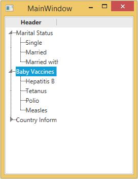
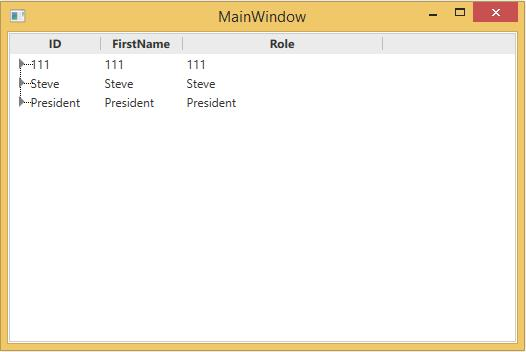

# Creating a MultiColumnTreeView

TreeView control can be created with multiple columns by setting the MultiColumnEnable property to __true__. This is dependency property, which gets or sets the value defining whether items are in multicolumn mode. The default value is __false______





<!-- Adding TreeViewAdv with Enabling multiple column -->
<syncfusion:TreeViewAdv  Name="treeViewAdv" MultiColumnEnable="True">
<!-- Adding TreeViewItemAdv -->
<syncfusion:TreeViewItemAdv Name="treeViewItemAdv" Header="Marital Status">
<syncfusion:TreeViewItemAdv Header="Single"/>
<syncfusion:TreeViewItemAdv Header="Married"/>
<syncfusion:TreeViewItemAdv Header="Married with Children"/>
</syncfusion:TreeViewItemAdv>
<syncfusion:TreeViewItemAdv Header="Baby Vaccines">
<syncfusion:TreeViewItemAdv Header="Hepatitis B"/>
<syncfusion:TreeViewItemAdv Header="Tetanus"/>
<syncfusion:TreeViewItemAdv Header="Polio"/>
<syncfusion:TreeViewItemAdv Header="Measles"/>
</syncfusion:TreeViewItemAdv>
<syncfusion:TreeViewItemAdv Header="Country Information">
<syncfusion:TreeViewItemAdv Header="Canada"/>
<syncfusion:TreeViewItemAdv Header="France"/>
<syncfusion:TreeViewItemAdv Header="Germany"/>
<syncfusion:TreeViewItemAdv Header="UK"/>
<syncfusion:TreeViewItemAdv Header="USA"/>
</syncfusion:TreeViewItemAdv>
</syncfusion:TreeViewAdv>





//Enable multiple column enable
treeViewAdv.MultiColumnEnable = true;





'Enable multiple column enable
treeViewAdv.MultiColumnEnable = True



  

## Header for MultiColumn

TreeViewAdv allow user to set headers for individual columns using the Columns property. All the columns are defined in TreeViewColumnCollections.





<!-- Adding TreeViewAdv with Enabling multiple column -->
<syncfusion:TreeViewAdv Name="treeViewAdv" MultiColumnEnable="True">
<!-- Adding TreeViewItemAdv -->
<syncfusion:TreeViewItemAdv Name="treeViewItemAdv" Header="Marital Status">
<syncfusion:TreeViewItemAdv Header="Single"/>
<syncfusion:TreeViewItemAdv Header="Married"/>
<syncfusion:TreeViewItemAdv Header="Married with Children"/>
</syncfusion:TreeViewItemAdv>
<syncfusion:TreeViewItemAdv Header="Baby Vaccines">
<syncfusion:TreeViewItemAdv Header="Hepatitis B"/>
<syncfusion:TreeViewItemAdv Header="Tetanus"/>
<syncfusion:TreeViewItemAdv Header="Polio"/>
<syncfusion:TreeViewItemAdv Header="Measles"/>
</syncfusion:TreeViewItemAdv>
<syncfusion:TreeViewItemAdv Header="Country Information">
<syncfusion:TreeViewItemAdv Header="Canada"/>
<syncfusion:TreeViewItemAdv Header="France"/>
<syncfusion:TreeViewItemAdv Header="Germany"/>
<syncfusion:TreeViewItemAdv Header="UK"/>
<syncfusion:TreeViewItemAdv Header="USA"/>
</syncfusion:TreeViewItemAdv>
<!-- Adding header -->
<syncfusion:TreeViewAdv.Columns>
<syncfusion:TreeViewColumnCollection>
<syncfusion:TreeViewColumn Width="150" Header="Status"
DisplayMemberBinding="{Binding Path=Header, RelativeSource={RelativeSource AncestorType={x:Type syncfusion:TreeViewItemAdv}}}"/>
<syncfusion:TreeViewColumn Width="100" Header="Vaccines"
DisplayMemberBinding="{Binding Path=Header, RelativeSource={RelativeSource AncestorType={x:Type syncfusion:TreeViewItemAdv}}}"/>
<syncfusion:TreeViewColumn Width="50" Header="Country"
DisplayMemberBinding="{Binding Path=Header, RelativeSource={RelativeSource AncestorType={x:Type syncfusion:TreeViewItemAdv}}}"/>
</syncfusion:TreeViewColumnCollection>
</syncfusion:TreeViewAdv.Columns>
</syncfusion:TreeViewAdv>





[View sample in GitHub](https://github.com/SyncfusionExamples/Create-multiple-column-in-wpf-treeviewadv)

## Auto-Resize of columns in Multicolumn TreeView

The width property of TreeViewColumn has changed from a double type to a GridLength type that can be set to the Auto or * values. When the column width is set as Auto, the desired size or minimum size will be set as the width of the column. When the width is set as, the remaining space that is available in the window will be set as the width of the column. Similarly, the value can be set as 0.3,2,128, etc.





<!-- Adding TreeViewAdv with Enabling multiple column -->
<syncfusion:TreeViewAdv Name="treeViewAdv" MultiColumnEnable="True">
<!-- Adding TreeViewItemAdv -->
<syncfusion:TreeViewItemAdv Name="treeViewItemAdv" Header="111">
<syncfusion:TreeViewItemAdv Header="211"/>
<syncfusion:TreeViewItemAdv Header="212"/>
<syncfusion:TreeViewItemAdv Header="213"/>
</syncfusion:TreeViewItemAdv>
<syncfusion:TreeViewItemAdv Header="Steve">
<syncfusion:TreeViewItemAdv Header="Charles"/>
<syncfusion:TreeViewItemAdv Header="Greg"/>
<syncfusion:TreeViewItemAdv Header="Danielle"/>
<syncfusion:TreeViewItemAdv Header="Ethan"/>
</syncfusion:TreeViewItemAdv>
<syncfusion:TreeViewItemAdv Header="President">
<syncfusion:TreeViewItemAdv Header="TeamLead"/>
<syncfusion:TreeViewItemAdv Header="TeamLead"/>
<syncfusion:TreeViewItemAdv Header="ProductLead"/>
<syncfusion:TreeViewItemAdv Header="ProductManager"/>
</syncfusion:TreeViewItemAdv>
<!-- Adding header -->
<syncfusion:TreeViewAdv.Columns>
<syncfusion:TreeViewColumnCollection>
<syncfusion:TreeViewColumn Width="90" Header="ID"
DisplayMemberBinding="{Binding Path=Header, RelativeSource={RelativeSource AncestorType={x:Type syncfusion:TreeViewItemAdv}}}"/>
<syncfusion:TreeViewColumn Width="Auto" Header="FirstName"
DisplayMemberBinding="{Binding Path=Header, RelativeSource={RelativeSource AncestorType={x:Type syncfusion:TreeViewItemAdv}}}"/>
<syncfusion:TreeViewColumn Width="200" Header="Role"
DisplayMemberBinding="{Binding Path=Header, RelativeSource={RelativeSource AncestorType={x:Type syncfusion:TreeViewItemAdv}}}"/>
</syncfusion:TreeViewColumnCollection>
</syncfusion:TreeViewAdv.Columns>
</syncfusion:TreeViewAdv>





## Allowing reordering columns

TreeViewAdv control now provides support to reorder the columns in the TreeViewAdv control by using the AllowsColumnReorder property. Enable this property using the below code.





<!-- Adding TreeViewAdv with Enabling multiple column -->
<syncfusion:TreeViewAdv Name="treeViewAdv" MultiColumnEnable="True">
<!-- Adding TreeViewItemAdv -->
<syncfusion:TreeViewItemAdv Name="treeViewItemAdv" Header="111">
<syncfusion:TreeViewItemAdv Header="211"/>
<syncfusion:TreeViewItemAdv Header="212"/>
<syncfusion:TreeViewItemAdv Header="213"/>
</syncfusion:TreeViewItemAdv>
<syncfusion:TreeViewItemAdv Header="Steve">
<syncfusion:TreeViewItemAdv Header="Charles"/>
<syncfusion:TreeViewItemAdv Header="Greg"/>
<syncfusion:TreeViewItemAdv Header="Danielle"/>
<syncfusion:TreeViewItemAdv Header="Ethan"/>
</syncfusion:TreeViewItemAdv>
<syncfusion:TreeViewItemAdv Header="President">
<syncfusion:TreeViewItemAdv Header="TeamLead"/>
<syncfusion:TreeViewItemAdv Header="TeamLead"/>
<syncfusion:TreeViewItemAdv Header="ProductLead"/>
<syncfusion:TreeViewItemAdv Header="ProductManager"/>
</syncfusion:TreeViewItemAdv>
<!-- Adding header -->
<syncfusion:TreeViewAdv.Columns>
<syncfusion:TreeViewColumnCollection>
<syncfusion:TreeViewColumn Width="200" Header="ID"
DisplayMemberBinding="{Binding Path=Header, RelativeSource={RelativeSource AncestorType={x:Type syncfusion:TreeViewItemAdv}}}"/>
<syncfusion:TreeViewColumn Width="Auto" Header="FirstName"
DisplayMemberBinding="{Binding Path=Header, RelativeSource={RelativeSource AncestorType={x:Type syncfusion:TreeViewItemAdv}}}"/>
<syncfusion:TreeViewColumn Width="*" Header="Role"
DisplayMemberBinding="{Binding Path=Header, RelativeSource={RelativeSource AncestorType={x:Type syncfusion:TreeViewItemAdv}}}"/>
</syncfusion:TreeViewColumnCollection>
</syncfusion:TreeViewAdv.Columns>
</syncfusion:TreeViewAdv>




