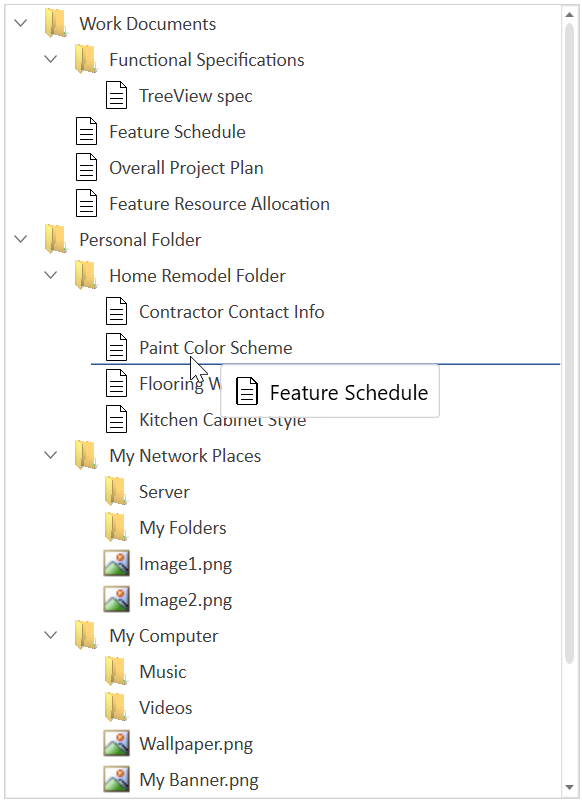
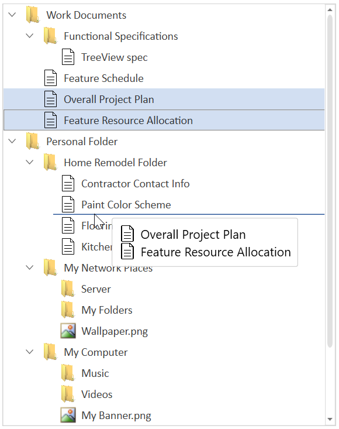
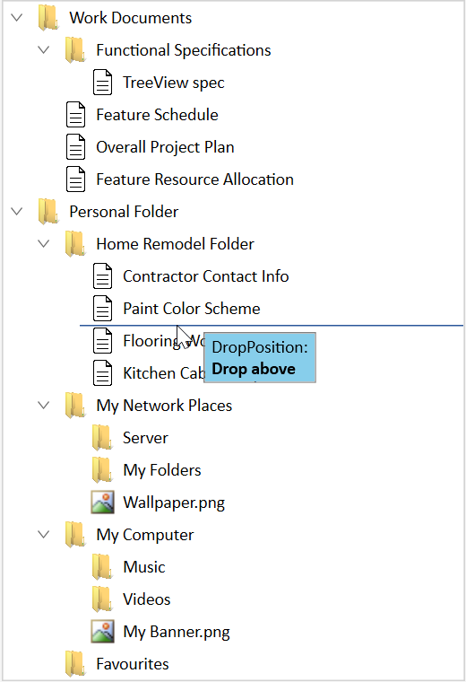
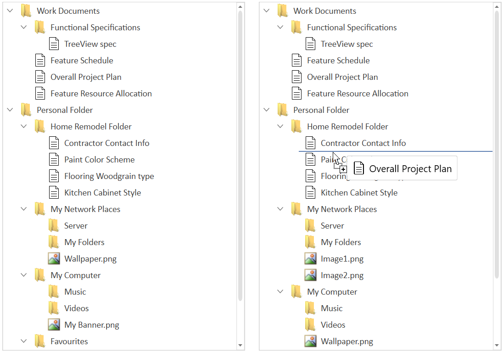

# Drag and drop in WPF TreeView (SfTreeView)

TreeView allows drag and drop the items within the treeview control by setting the [AllowDragging](https://help.syncfusion.com/cr/wpf/Syncfusion.UI.Xaml.TreeView.SfTreeView.html#Syncfusion_UI_Xaml_TreeView_SfTreeView_AllowDragging) property as `true`. It is also possible to drag and drop the items between treeview and other controls such as `ListView` and `SfDataGrid`. 



<treeview:SfTreeView
    Name="sfTreeView"
    AllowDragging="True"
    ChildPropertyName="Childs"
    ItemsSource="{Binding Nodes1}" />


sfTreeView.AllowDragging = true;



While dropping, the dragged items can be added above or below to the target item based on drag indicator position.

## Dragging multiple items

SfTreeView allows to drag multiple selected items. To enable multiple selection, set the [SfTreeView.SelectionMode](https://help.syncfusion.com/cr/wpf/Syncfusion.UI.Xaml.TreeView.SfTreeView.html#Syncfusion_UI_Xaml_TreeView_SfTreeView_SelectionMode) as `Multiple` or `Extended`. 

## Drag and drop events

SfTreeView triggers the following events when drag and drop:

### ItemDragStarting event

[ItemDragStarting](https://help.syncfusion.com/cr/wpf/Syncfusion.UI.Xaml.TreeView.SfTreeView.html) event occurs when you starting to drag the items in treeview. The [TreeViewItemDragStartingEventArgs](https://help.syncfusion.com/cr/wpf/Syncfusion.UI.Xaml.TreeView.TreeViewItemDragStartingEventArgs.html)  has the following member, which provides information for the `ItemDragStarting` event.

* [Data](https://help.syncfusion.com/cr/wpf/Syncfusion.UI.Xaml.TreeView.TreeViewItemDragStartingEventArgs.html#Syncfusion_UI_Xaml_TreeView_TreeViewItemDragStartingEventArgs_Data) : Gets or Sets a data object that contains the data associated while dragging the items. 
* [DraggingNodes](https://help.syncfusion.com/cr/wpf/Syncfusion.UI.Xaml.TreeView.TreeViewItemDragStartingEventArgs.html#Syncfusion_UI_Xaml_TreeView_TreeViewItemDragStartingEventArgs_DraggingNodes) : Gets the collection of [TreeViewNode](https://help.syncfusion.com/cr/wpf/Syncfusion.UI.Xaml.TreeView.Engine.TreeViewNode.html) which are dragged.If you set the Data property, the value of DraggingNodes property will be `null`.
* [Cancel](https://help.syncfusion.com/cr/wpf/Syncfusion.UI.Xaml.TreeView.TreeViewItemDragStartingEventArgs.html#Syncfusion_UI_Xaml_TreeView_TreeViewItemDragStartingEventArgs_Cancel) : Gets or sets a value indicating whether dragging should be canceled.



sfTreeView.ItemDragStarting += SfTreeView_ItemDragStarting;

private void SfTreeView_ItemDragStarting(object sender, Syncfusion.UI.Xaml.TreeView.TreeViewItemDragStartingEventArgs e)
{
    
}




### ItemDragStarted event

[ItemDragStarted](https://help.syncfusion.com/cr/wpf/Syncfusion.UI.Xaml.TreeView.SfTreeView.html)  event occurs after started the dragging, in treeview. The [TreeViewItemDragStartedEventArgs](https://help.syncfusion.com/cr/wpf/Syncfusion.UI.Xaml.TreeView.TreeViewItemDragStartedEventArgs.html)  has the following member, which provides information for the `ItemDragStarted` event.

* [Data](https://help.syncfusion.com/cr/wpf/Syncfusion.UI.Xaml.TreeView.TreeViewItemDragStartedEventArgs.html#Syncfusion_UI_Xaml_TreeView_TreeViewItemDragStartedEventArgs_Data) : Gets a data object that contains the data associated while dragging the items. 
* [DraggingNodes](https://help.syncfusion.com/cr/wpf/Syncfusion.UI.Xaml.TreeView.TreeViewItemDragStartedEventArgs.html#Syncfusion_UI_Xaml_TreeView_TreeViewItemDragStartedEventArgs_DraggingNodes) : Gets the collection of [TreeViewNode](https://help.syncfusion.com/cr/wpf/Syncfusion.UI.Xaml.TreeView.Engine.TreeViewNode.html) which are dragged.



sfTreeView.ItemDragStarted += SfTreeView_ItemDragStarted;

private void SfTreeView_ItemDragStarted(object sender, Syncfusion.UI.Xaml.TreeView.TreeViewItemDragStartedEventArgs e)
{
   
}



### ItemDragOver event

[ItemDragOver](https://help.syncfusion.com/cr/wpf/Syncfusion.UI.Xaml.TreeView.SfTreeView.html) event occurs continuously while item is dragged within the targeted SfTreeView. The [TreeViewItemDragOverEventArgs](https://help.syncfusion.com/cr/wpf/Syncfusion.UI.Xaml.TreeView.TreeViewItemDragOverEventArgs.html) has the following members, which provide information for the `ItemDragOver` event.

* [Data](https://help.syncfusion.com/cr/wpf/Syncfusion.UI.Xaml.TreeView.TreeViewItemDragOverEventArgs.html#Syncfusion_UI_Xaml_TreeView_TreeViewItemDragOverEventArgs_Data) : Gets a data object that contains the data associated while dragging the items. 
* [DraggingNodes](https://help.syncfusion.com/cr/wpf/Syncfusion.UI.Xaml.TreeView.TreeViewItemDragOverEventArgs.html#Syncfusion_UI_Xaml_TreeView_TreeViewItemDragOverEventArgs_DraggingNodes) : Gets the collection of [TreeViewNode](https://help.syncfusion.com/cr/wpf/Syncfusion.UI.Xaml.TreeView.Engine.TreeViewNode.html) which are dragged.
* [DragSource](https://help.syncfusion.com/cr/wpf/Syncfusion.UI.Xaml.TreeView.TreeViewItemDragOverEventArgs.html#Syncfusion_UI_Xaml_TreeView_TreeViewItemDragOverEventArgs_DragSource) : Gets the source of the transferred data.
* [DropPosition](https://help.syncfusion.com/cr/wpf/Syncfusion.UI.Xaml.TreeView.TreeViewItemDragOverEventArgs.html#Syncfusion_UI_Xaml_TreeView_TreeViewItemDragOverEventArgs_DropPosition) : Gets or sets the position where dragged nodes are going to be dropped.
* [TargetNode](https://help.syncfusion.com/cr/wpf/Syncfusion.UI.Xaml.TreeView.TreeViewItemDragOverEventArgs.html#Syncfusion_UI_Xaml_TreeView_TreeViewItemDragOverEventArgs_TargetNode) : Gets the node where the dragged nodes are going to be dropped.



sfTreeView.ItemDragOver += SfTreeView_ItemDragOver;
private void SfTreeView_ItemDragOver(object sender, Syncfusion.UI.Xaml.TreeView.TreeViewItemDragOverEventArgs e)
{
  
}



### ItemDropping event

[ItemDropping](https://help.syncfusion.com/cr/wpf/Syncfusion.UI.Xaml.TreeView.SfTreeView.html) event occurs when item is dropping within the targeted SfTreeView. The [TreeViewItemDroppingEventArgs](https://help.syncfusion.com/cr/wpf/Syncfusion.UI.Xaml.TreeView.TreeViewItemDroppingEventArgs.html) has the following members, which provide information for the `ItemDropping` event.

* [Data](https://help.syncfusion.com/cr/wpf/Syncfusion.UI.Xaml.TreeView.TreeViewItemDroppingEventArgs.html#Syncfusion_UI_Xaml_TreeView_TreeViewItemDroppingEventArgs_Data) : Gets a data object that contains the data associated while dragging the items. 
* [DraggingNodes](https://help.syncfusion.com/cr/wpf/Syncfusion.UI.Xaml.TreeView.TreeViewItemDroppingEventArgs.html#Syncfusion_UI_Xaml_TreeView_TreeViewItemDroppingEventArgs_DraggingNodes) : Gets the collection of [TreeViewNode](https://help.syncfusion.com/cr/wpf/Syncfusion.UI.Xaml.TreeView.Engine.TreeViewNode.html) which are dragged.
* [DragSource](https://help.syncfusion.com/cr/wpf/Syncfusion.UI.Xaml.TreeView.TreeViewItemDroppingEventArgs.html#Syncfusion_UI_Xaml_TreeView_TreeViewItemDroppingEventArgs_DragSource) : Gets the source of the transferred data.
* [DropPosition](https://help.syncfusion.com/cr/wpf/Syncfusion.UI.Xaml.TreeView.TreeViewItemDroppingEventArgs.html#Syncfusion_UI_Xaml_TreeView_TreeViewItemDroppingEventArgs_DropPosition) : Gets or sets the position where dragged nodes are going to be dropped.
* [Handled](https://help.syncfusion.com/cr/wpf/Syncfusion.UI.Xaml.TreeView.TreeViewItemDroppingEventArgs.html#Syncfusion_UI_Xaml_TreeView_TreeViewItemDroppingEventArgs_Handled) : Gets or sets a value indicating whether the event is handled. If this event is handled, dragged nodes will not be dropped to TreeView.
* [TargetNode](https://help.syncfusion.com/cr/wpf/Syncfusion.UI.Xaml.TreeView.TreeViewItemDroppingEventArgs.html#Syncfusion_UI_Xaml_TreeView_TreeViewItemDroppingEventArgs_TargetNode) : Gets the node where the dragged nodes are going to be dropped.



sfTreeView.ItemDropping += SfTreeView_ItemDropping;

private void SfTreeView_ItemDropping(object sender, Syncfusion.UI.Xaml.TreeView.TreeViewItemDroppingEventArgs e)
{
    
}



### ItemDropped event

[ItemDropped](https://help.syncfusion.com/cr/wpf/Syncfusion.UI.Xaml.TreeView.SfTreeView.html) event occurs when item is dropped within the targeted SfTreeView. The [TreeViewItemDroppedEventArgs](https://help.syncfusion.com/cr/wpf/Syncfusion.UI.Xaml.TreeView.TreeViewItemDroppedEventArgs.html) has the following members, which provide information for the `Drop` event.
* [Data](https://help.syncfusion.com/cr/wpf/Syncfusion.UI.Xaml.TreeView.TreeViewItemDroppedEventArgs.html#Syncfusion_UI_Xaml_TreeView_TreeViewItemDroppedEventArgs_Data) : Gets a data object that contains the data associated while dragging the items. 
* [DraggingNodes](https://help.syncfusion.com/cr/wpf/Syncfusion.UI.Xaml.TreeView.TreeViewItemDroppedEventArgs.html#Syncfusion_UI_Xaml_TreeView_TreeViewItemDroppedEventArgs_DraggingNodes) : Gets the collection of [TreeViewNode](https://help.syncfusion.com/cr/wpf/Syncfusion.UI.Xaml.TreeView.Engine.TreeViewNode.html) which are dragged.
* [DragSource](https://help.syncfusion.com/cr/wpf/Syncfusion.UI.Xaml.TreeView.TreeViewItemDroppedEventArgs.html#Syncfusion_UI_Xaml_TreeView_TreeViewItemDroppedEventArgs_DragSource) : Gets the source of the transferred data.
* [DropPosition](https://help.syncfusion.com/cr/wpf/Syncfusion.UI.Xaml.TreeView.TreeViewItemDroppedEventArgs.html#Syncfusion_UI_Xaml_TreeView_TreeViewItemDroppedEventArgs_DropPosition) : Gets the position where dragged nodes are dropped.
* [TargetNode](https://help.syncfusion.com/cr/wpf/Syncfusion.UI.Xaml.TreeView.TreeViewItemDroppedEventArgs.html#Syncfusion_UI_Xaml_TreeView_TreeViewItemDroppedEventArgs_TargetNode) : Gets the node where the dragged nodes are dropped.



sfTreeView.ItemDropped += SfTreeView_ItemDropped;

private void SfTreeView_ItemDropped(object sender, Syncfusion.UI.Xaml.TreeView.TreeViewItemDroppedEventArgs e)
{
   
}




## Customizing the drag and drop operation

### Disable dragging of certain items in WPF TreeView

You can restrict the dragging of certain nodes in SfTreeView by using the  [SfTreeView.ItemDragStarting](https://help.syncfusion.com/cr/wpf/Syncfusion.UI.Xaml.TreeView.SfTreeView.html) event.



sfTreeView.ItemDragStarting += SfTreeView_ItemDragStarting;

private void SfTreeView_ItemDragStarting(object sender, Syncfusion.UI.Xaml.TreeView.TreeViewItemDragStartingEventArgs e)
{
    var record = e.DraggingNodes[0].Content as Model;
    if (record.Header == "Feature Schedule")
        e.Cancel = true;
}




### Disable dropping on certain items in WPF TreeView

You can restrict the dropping the items on certain nodes in SfTreeView by using the [SfTreeView.ItemDropping](https://help.syncfusion.com/cr/wpf/Syncfusion.UI.Xaml.TreeView.SfTreeView.html) event.



 sfTreeView.ItemDropping += SfTreeView_ItemDropping;

private void SfTreeView_ItemDropping(object sender, Syncfusion.UI.Xaml.TreeView.TreeViewItemDroppingEventArgs e)
{
    var record = e.TargetNode.Content as Model;
    if (record.Header == "Home Remodel Folder")
        e.Handled = true;
}



### Customize the drop position

You can customize the drop position of dragging nodes in SfTreeView by using the [SfTreeView.ItemDropping](https://help.syncfusion.com/cr/wpf/Syncfusion.UI.Xaml.TreeView.SfTreeView.html) event.



sfTreeView.ItemDropping += SfTreeView_ItemDropping;

private void SfTreeView_ItemDropping(object sender, Syncfusion.UI.Xaml.TreeView.TreeViewItemDroppingEventArgs e)
{
    var record = e.TargetNode.Content as Model;
    if (record.Header == "Home Remodel Folder")
        e.DropPosition = Syncfusion.UI.Xaml.TreeView.DropPosition.DropAsChild;
}




### Customizing drag Popup

To customize the draggable popup, use the [DragPreviewTemplate](https://help.syncfusion.com/cr/wpf/Syncfusion.UI.Xaml.TreeView.SfTreeView.html#Syncfusion_UI_Xaml_TreeView_SfTreeView_DragPreviewTemplate) property in the SfTreeView. The DataContext of DragPreviewTemplate is [TreeViewDragInfo](https://help.syncfusion.com/cr/wpf/Syncfusion.UI.Xaml.TreeView.TreeViewDragInfo.html).



<syncfusion:ChromelessWindow.Resources>
    <DataTemplate x:Key="dragPreviewTemplate">
        <Border BorderBrush="Gray" BorderThickness="1">
            <Grid Background="SkyBlue">
                <Grid.RowDefinitions>
                    <RowDefinition />
                    <RowDefinition/>
                </Grid.RowDefinitions>
                <TextBlock Grid.Row="0" Margin="5,2,5,0"
                VerticalAlignment="Center" Text="DropPosition:"/>
                <TextBlock Grid.Row="1"
                Margin="5,0,5,2"
                VerticalAlignment="Center"
                Text="{Binding DragCaption}" FontWeight="Bold"/>
            </Grid>
        </Border>            
    </DataTemplate>    
</syncfusion:ChromelessWindow.Resources>

<treeview:SfTreeView
    Name="sfTreeView"
    AllowDragging="True"
    ChildPropertyName="Childs"
    DragPreviewTemplate="{StaticResource dragPreviewTemplate}"
    ItemsSource="{Binding Nodes1}" />




## Drag and drop between two TreeView's

You can customize the dragging operation between two treeview by using the [SfTreeView.ItemDragStarting](https://help.syncfusion.com/cr/wpf/Syncfusion.UI.Xaml.TreeView.SfTreeView.html) , [SfTreeView.ItemDropping](https://help.syncfusion.com/cr/wpf/Syncfusion.UI.Xaml.TreeView.SfTreeView.html) and [SfTreeView.ItemDropped](https://help.syncfusion.com/cr/wpf/Syncfusion.UI.Xaml.TreeView.SfTreeView.html) events.




AssociatedObject.sfTreeView1.ItemDragStarting += SfTreeView1_ItemDragStarting;    
AssociatedObject.sfTreeView1.ItemDropping += SfTreeView1_ItemDropping;
AssociatedObject.sfTreeView2.ItemDropping += SfTreeView2_ItemDropping;
AssociatedObject.sfTreeView2.ItemDropped += SfTreeView1_ItemDropped;
    
 /// 

 /// Customizing the ItemStarting event
 /// 

 /// <param name="sender"></param>
 /// <param name="e"></param>
 private void SfTreeView1_ItemDragStarting(object sender, Syncfusion.UI.Xaml.TreeView.TreeViewItemDragStartingEventArgs e)
 {
     //Restrict the dragging for certain node
     var record = e.DraggingNodes[0].Content as Model;
     if (record.Header == "Feature Schedule")
         e.Cancel = true;
 }

 /// 

 /// Customizing the ItemDropping event
 /// 

 /// <param name="sender"></param>
 /// <param name="e"></param>
 private void SfTreeView1_ItemDropping(object sender, Syncfusion.UI.Xaml.TreeView.TreeViewItemDroppingEventArgs e)
 {
     //Restrict the dropping in first treeview
     e.Handled = true;
 }

 /// 

 /// Customizing the ItemDropping event
 /// 

 /// <param name="sender"></param>
 /// <param name="e"></param>
 private void SfTreeView2_ItemDropping(object sender, Syncfusion.UI.Xaml.TreeView.TreeViewItemDroppingEventArgs e)
 {
     //Restrict the dropping for drop position as above
     if (e.DropPosition == Syncfusion.UI.Xaml.TreeView.DropPosition.DropAbove)
         e.Handled = true;

     //Restrict the dropping on certain nodes
     var record = e.TargetNode.Content as Model;
     if (record.Header == "My Folders")
         e.Handled = true;
 }

 /// 

 /// Customize the ItemDropped event
 /// 

 /// <param name="sender"></param>
 /// <param name="e"></param>
 private void SfTreeView1_ItemDropped(object sender, Syncfusion.UI.Xaml.TreeView.TreeViewItemDroppedEventArgs e)
 {
     var parentNode = e.TargetNode.ParentNode;
     var collection = parentNode.ChildNodes;
     var record = e.DraggingNodes[0].Content as Model;
     int count = 0;
     foreach (var child in parentNode.ChildNodes)
     {
         var childNode = child.Content as Model;
         if (childNode.Header == record.Header)
         {
             count++;
             if (count > 1)
             {
                // Remove dropped node if the parent has the same node in it
                 collection.Remove(child);
                 return;
             }

         }
     }
 }




N> View sample in [GitHub](https://github.com/syncfusion/wpf-demos/tree/master/treeview)
