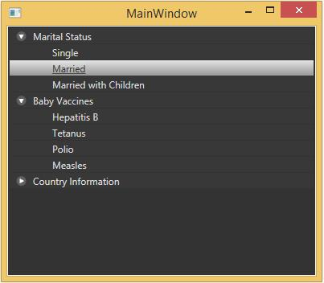
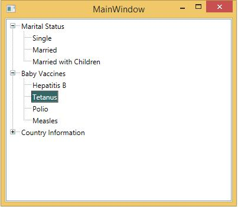
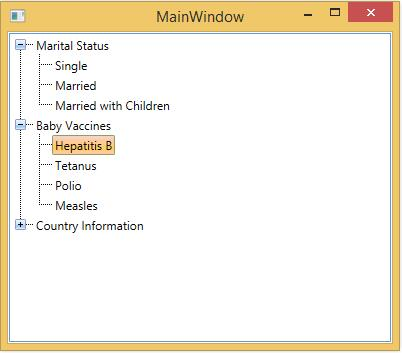
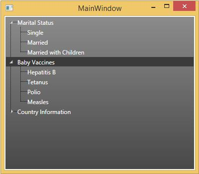
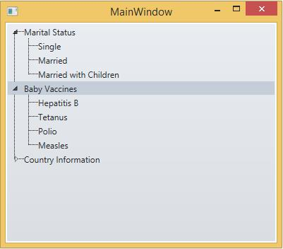
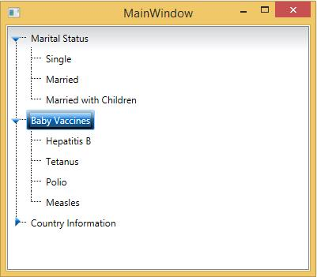
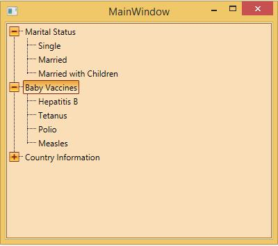

# Appearance

This section deals with the appearance of TreeViewAdv control and contains the following topics:

## Customizing the Appearance of the TreeViewAdv

The TreeViewAdv appearance is customized by using the appearance properties available in the control. You can set the color for the Foreground, Background, Selected Item Foreground, Selected Item Background, MouseOver Foreground and MouseOver Background of TreeViewAdv control.

* SelectedBackground: Gets or sets the background color of the selected treeview item
* SelectedForeground: Gets or sets the foreground color of the selected treeview item
* MouseOverForeground: Gets or sets the foreground color of the treeview item over which the mouse pointer moves
* MouseOverBackground: Gets or sets the background color of the treeview item over which the mouse pointer moves
* SelectionUnfocussedBackground: Gets or sets the background color of the selected treeview item when the item loses focus

The following code example illustrates the above property settings.



<!-- Adding TreeViewAdv With Brushes -->

<syncfusion:TreeViewAdv MouseOverBackground="Aqua" MouseOverForeground="Magenta" Name="treeViewAdv" SelectedBackground="Orange" SelectedForeground="Red" SelectionUnfocussedBackcolor="Gold">

    <!-- Adding TreeViewItemAdv -->

    <syncfusion:TreeViewItemAdv Header="Marital Status">

        <syncfusion:TreeViewItemAdv Header="Single"/>

        <syncfusion:TreeViewItemAdv Header="Married"/>

        <syncfusion:TreeViewItemAdv Header="Married with Children"/>

    </syncfusion:TreeViewItemAdv>

    <syncfusion:TreeViewItemAdv Header="Baby Vaccines">

        <syncfusion:TreeViewItemAdv Header="Hepatitis B"/>

        <syncfusion:TreeViewItemAdv Header="Tetanus"/>

        <syncfusion:TreeViewItemAdv Header="Polio"/>

        <syncfusion:TreeViewItemAdv Header="Measles"/>

    </syncfusion:TreeViewItemAdv>

    <syncfusion:TreeViewItemAdv Header="Country Information"/>

</syncfusion:TreeViewAdv>





// Set MouseOverBackground property

treeViewAdv.MouseOverBackground = Brushes.Aqua;

// Set MouseOverForeground property

treeViewAdv.MouseOverForeground = Brushes.Magenta;

// Set SelectedBackground property

treeViewAdv.SelectedBackground = Brushes.Orange;

// Set SelectedForeground property

treeViewAdv.SelectedForeground = Brushes.Red;

// Set SelectionUnfocussedBackcolor property

treeViewAdv.SelectionUnfocussedBackcolor = Brushes.Gold;



_SelectedBackground = "Orange"; SelectedForeground = "Red"; SelectionUnfocussedBackcolor = "Gold"_

## Setting Visual Style

The appearance of the TreeViewAdv control is customized by using the VisualStyle property. It gets or sets the visual style for the TreeViewAdv control. 

The various built-in visual styles are listed below.

* Blend
* Office2003
* Office2007Blue
* Office2007Black
* Office2007Silver
* ShinyBlue
* ShinyRed
* SyncOrange
* VS2010
* Metro
* Transparent



<!-- Adding TreeViewAdv with visual style -->

<syncfusion:TreeViewAdv Name="treeViewAdv" syncfusion:SkinStorage.VisualStyle="Office2007Blue">

  <!-- Adding TreeViewItemAdv -->

  <syncfusion:TreeViewItemAdv Header="Marital Status">

    <syncfusion:TreeViewItemAdv Header="Single"/>

    <syncfusion:TreeViewItemAdv Header="Married"/>

    <syncfusion:TreeViewItemAdv Header="Married with Children"/>

  </syncfusion:TreeViewItemAdv>

  <syncfusion:TreeViewItemAdv Header="Baby Vaccines">

    <syncfusion:TreeViewItemAdv Header="Hepatitis B"/>

    <syncfusion:TreeViewItemAdv Header="Tetanus"/>

    <syncfusion:TreeViewItemAdv Header="Polio"/>

    <syncfusion:TreeViewItemAdv Header="Measles"/>

  </syncfusion:TreeViewItemAdv>

  <syncfusion:TreeViewItemAdv Header="Country Information">

    <syncfusion:TreeViewItemAdv Header="Canada"/>

    <syncfusion:TreeViewItemAdv Header="France"/>

    <syncfusion:TreeViewItemAdv Header="Germany"/>

    <syncfusion:TreeViewItemAdv Header="UK"/>

    <syncfusion:TreeViewItemAdv Header="USA"/>

  </syncfusion:TreeViewItemAdv>

</syncfusion:TreeViewAdv>





//Setting the visaul style as Office2007Blue 

SkinStorage.SetVisualStyle(treeViewAdv, "Office2007Blue"); 



## Customizing HeaderTextDecorations

You can decorate the header text of the TreeView columns using simple property settings. This is done by defining the HeaderTextDecoration class with customization options.



<!-- Adding TreeViewAdv with Text Decorations -->

<syncfusion:TreeViewAdv Name="treeViewAdv">

  <!-- Adding TreeViewItemAdv -->

  <syncfusion:TreeViewItemAdv Name="treeViewItemAdv1" Header="Marital Status">

    <syncfusion:TreeViewItemAdv.HeaderTextDecorations>

      <TextDecorationCollection>

        <TextDecoration>

          <TextDecoration.Pen>

            <Pen Brush="#FF6699CC"/>

          </TextDecoration.Pen>

        </TextDecoration>

      </TextDecorationCollection>

    </syncfusion:TreeViewItemAdv.HeaderTextDecorations>

    <syncfusion:TreeViewItemAdv Header="Single"/>

    <syncfusion:TreeViewItemAdv Header="Married"/>

    <syncfusion:TreeViewItemAdv Header="Married with Children"/>

  </syncfusion:TreeViewItemAdv>

  <syncfusion:TreeViewItemAdv Name="treeViewItemAdv2" Header="Baby Vaccines">

    <syncfusion:TreeViewItemAdv Header="Hepatitis B"/>

    <syncfusion:TreeViewItemAdv Header="Tetanus"/>

    <syncfusion:TreeViewItemAdv Header="Polio"/>

    <syncfusion:TreeViewItemAdv Header="Measles"/>

  </syncfusion:TreeViewItemAdv>

  <syncfusion:TreeViewItemAdv Header="Country Information">

    <syncfusion:TreeViewItemAdv Header="Canada"/>

    <syncfusion:TreeViewItemAdv Header="France"/>

    <syncfusion:TreeViewItemAdv Header="Germany"/>

    <syncfusion:TreeViewItemAdv Header="UK"/>

    <syncfusion:TreeViewItemAdv Header="USA"/>

  </syncfusion:TreeViewItemAdv>

</syncfusion:TreeViewAdv>



## Customizing Root Lines

The TreeViewAdv displays root lines, which link the nodes of a tree structure. These TreeViewAdv root lines are displayed or hidden by using the ShowRootLines property of the class TreeViewAdv. To set this property, use the below code



<!-- Adding TreeViewAdv With show root lines -->

<syncfusion:TreeViewAdv Name="treeViewAdv" ShowRootLines="False">

    <!-- Adding TreeViewItemAdv -->

    <syncfusion:TreeViewItemAdv Header="Marital Status">

        <syncfusion:TreeViewItemAdv Header="Single"/>

        <syncfusion:TreeViewItemAdv Header="Married"/>

        <syncfusion:TreeViewItemAdv Header="Married with Children"/>

    </syncfusion:TreeViewItemAdv>

    <syncfusion:TreeViewItemAdv Header="Baby Vaccines">

        <syncfusion:TreeViewItemAdv Header="Hepatitis B"/>

        <syncfusion:TreeViewItemAdv Header="Tetanus"/>

        <syncfusion:TreeViewItemAdv Header="Polio"/>

        <syncfusion:TreeViewItemAdv Header="Measles"/>

    </syncfusion:TreeViewItemAdv>

    <syncfusion:TreeViewItemAdv Header="Country Information"/>

</syncfusion:TreeViewAdv>





// Show root lines

treeViewAdv.ShowRootLines = false;



### See Also

Line Color, Line Pen

#### Line Color

The color of the root lines, which connect different nodes in a TreeViewAdv control is changed by using the LineBrush property. Use the following code example to set the color of the root lines.



<!-- Adding TreeViewAdv With show root lines and line brush -->

<syncfusion:TreeViewAdv Name="treeViewAdv" LineBrush="Red" ShowRootLines="True">

    <!-- Adding TreeViewItemAdv -->

    <syncfusion:TreeViewItemAdv Header="Marital Status">

        <syncfusion:TreeViewItemAdv Header="Single"/>

        <syncfusion:TreeViewItemAdv Header="Married"/>

        <syncfusion:TreeViewItemAdv Header="Married with Children"/>

    </syncfusion:TreeViewItemAdv>

    <syncfusion:TreeViewItemAdv Header="Baby Vaccines">

        <syncfusion:TreeViewItemAdv Header="Hepatitis B"/>

        <syncfusion:TreeViewItemAdv Header="Tetanus"/>

        <syncfusion:TreeViewItemAdv Header="Polio"/>

        <syncfusion:TreeViewItemAdv Header="Measles"/>

    </syncfusion:TreeViewItemAdv>

    <syncfusion:TreeViewItemAdv Header="Country Information"/>

</syncfusion:TreeViewAdv>





// Show root lines

treeViewAdv.ShowRootLines = true;

// Set line brush

treeViewAdv.LineBrush = Brushes.Red;



###See Also

Root Lines, Line Pen

#### Line Pen

The root lines which connect different nodes in a TreeViewAdv control are customized by using the LinePen property. This property specifies the pen color for a node line. To set the LinePen property, refer the below code



<!-- Adding TreeViewAdv With show root lines and line pen -->

<syncfusion:TreeViewAdv Name="treeViewAdv" ShowRootLines="True">

    <syncfusion:TreeViewAdv.LinePen>

        <Pen Brush="Red" Thickness="1"/>

    </syncfusion:TreeViewAdv.LinePen>

    <!-- Adding TreeViewItemAdv -->

    <syncfusion:TreeViewItemAdv Header="Marital Status">

        <syncfusion:TreeViewItemAdv Header="Single"/>

        <syncfusion:TreeViewItemAdv Header="Married"/>

        <syncfusion:TreeViewItemAdv Header="Married with Children"/>

    </syncfusion:TreeViewItemAdv>

    <syncfusion:TreeViewItemAdv Header="Baby Vaccines">

        <syncfusion:TreeViewItemAdv Header="Hepatitis B"/>

        <syncfusion:TreeViewItemAdv Header="Tetanus"/>

        <syncfusion:TreeViewItemAdv Header="Polio"/>

        <syncfusion:TreeViewItemAdv Header="Measles"/>

    </syncfusion:TreeViewItemAdv>

    <syncfusion:TreeViewItemAdv Header="Country Information"/>

</syncfusion:TreeViewAdv>





// Show root lines

treeViewAdv.ShowRootLines = true;

// Set line Pen

treeViewAdv.LinePen = new Pen(Brushes.Red, 1);



### See Also

Root Lines, Line Color

## Customizing Item Foreground

TreeViewAdv provides support to set the text color of the items that are dragged by using the FakeItemForeground property. The following code example can be used to set this property.



<!-- Adding TreeViewAdv with FakeDragIndicator and FakeItem foreground -->

<syncfusion:TreeViewAdv FakeItemForeground="Magenta" IsFakeDragIndicator="True" Name="treeViewAdv">

    <!-- Adding TreeViewItemAdv -->

    <syncfusion:TreeViewItemAdv Header="Marital Status">

        <syncfusion:TreeViewItemAdv Header="Single"/>

        <syncfusion:TreeViewItemAdv Header="Married"/>

        <syncfusion:TreeViewItemAdv Header="Married with Children"/>

    </syncfusion:TreeViewItemAdv>

    <syncfusion:TreeViewItemAdv Header="Baby Vaccines">

        <syncfusion:TreeViewItemAdv Header="Hepatitis B"/>

        <syncfusion:TreeViewItemAdv Header="Tetanus"/>

        <syncfusion:TreeViewItemAdv Header="Polio"/>

        <syncfusion:TreeViewItemAdv Header="Measles"/>

    </syncfusion:TreeViewItemAdv>

    <syncfusion:TreeViewItemAdv Header="Country Information"/>

</syncfusion:TreeViewAdv>



// Set Fake Item foreground

treeViewAdv.FakeItemForeground = Brushes.Magenta;

