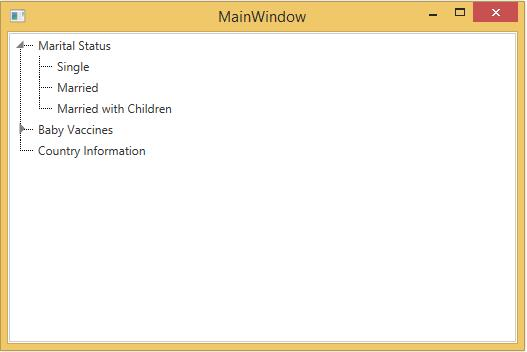

# Expand the item

TreeViewAdv allow user to expand or collapse each item by enabling or disabling the IsExpanded property. Use the following code to set this property.




<!-- Adding TreeViewAdv with expand the node -->

<syncfusion:TreeViewAdv Name="treeViewAdv">

<!-- Adding TreeViewItemAdv -->

<syncfusion:TreeViewItemAdv Name="treeViewItemAdv" IsExpanded="True" Header="Marital Status">

<syncfusion:TreeViewItemAdv Header="Single"/>

<syncfusion:TreeViewItemAdv Header="Married"/>

<syncfusion:TreeViewItemAdv Header="Married with Children"/>

</syncfusion:TreeViewItemAdv>

<syncfusion:TreeViewItemAdv Header="Baby Vaccines">

<syncfusion:TreeViewItemAdv Header="Hepatitis B"/>

<syncfusion:TreeViewItemAdv Header="Tetanus"/>

<syncfusion:TreeViewItemAdv Header="Polio"/>

<syncfusion:TreeViewItemAdv Header="Measles"/>

</syncfusion:TreeViewItemAdv>

<syncfusion:TreeViewItemAdv Header="Country Information"/>

</syncfusion:TreeViewAdv>








// Enable IsExpanded

treeViewItemAdv.IsExpanded = true;







  

## Animation Type

The type of animation that is generated while expanding or collapsing the TreeViewAdv is controlled by using the AnimationType property. This property includes the following options.

* Fade—animation fades out when the TreeViewAdv is collapsed or expanded
* None—no animation is generated
* Slide—animation slides when the TreeViewAdv is collapsed or expanded

The default value of this property is set to Slide.

Use the following code to set this property.




<syncfusion:TreeViewAdv Name="treeViewAdv" AnimationType="Fade">

<!-- Adding TreeViewItemAdv -->

<syncfusion:TreeViewItemAdv Name="treeViewItemAdv"   Header="Marital Status">

<syncfusion:TreeViewItemAdv Header="Single"/>

<syncfusion:TreeViewItemAdv Header="Married"/>

<syncfusion:TreeViewItemAdv Header="Married with Children"/>

</syncfusion:TreeViewItemAdv>

<syncfusion:TreeViewItemAdv Header="Baby Vaccines">

<syncfusion:TreeViewItemAdv Header="Hepatitis B"/>

<syncfusion:TreeViewItemAdv Header="Tetanus"/>

<syncfusion:TreeViewItemAdv Header="Polio"/>

<syncfusion:TreeViewItemAdv Header="Measles"/>

</syncfusion:TreeViewItemAdv>

<syncfusion:TreeViewItemAdv Header="Country Information"/>

</syncfusion:TreeViewAdv>








// Set animation type as Fade.

treeViewAdv.AnimationType = AnimationType.Fade;

// Set animation type as Slide.

treeViewAdv.AnimationType = AnimationType.Slide;

// Set animation type as None.

treeViewAdv.AnimationType = AnimationType.None;







  

## Animation Speed

The speed of animation that is generated while expanding or collapsing the TreeViewAdv is controlled by using the AnimationSpeed property. The default value of this property is set to __1__. To set this property, use the below code




<syncfusion:TreeViewAdv Name="treeViewAdv" AnimationSpeed="2">

<!-- Adding TreeViewItemAdv -->

<syncfusion:TreeViewItemAdv Name="treeViewItemAdv"   Header="Marital Status">

<syncfusion:TreeViewItemAdv Header="Single"/>

<syncfusion:TreeViewItemAdv Header="Married"/>

<syncfusion:TreeViewItemAdv Header="Married with Children"/>

</syncfusion:TreeViewItemAdv>

<syncfusion:TreeViewItemAdv Header="Baby Vaccines">

<syncfusion:TreeViewItemAdv Header="Hepatitis B"/>

<syncfusion:TreeViewItemAdv Header="Tetanus"/>

<syncfusion:TreeViewItemAdv Header="Polio"/>

<syncfusion:TreeViewItemAdv Header="Measles"/>

</syncfusion:TreeViewItemAdv>

<syncfusion:TreeViewItemAdv Header="Country Information"/>

</syncfusion:TreeViewAdv>








// Set animation speed

treeViewAdv.AnimationSpeed = 2;







  

## Expand Animation

The Expand or Collapse operation in a TreeViewItemAdv leads to an animated action. This animation is controlled by using the ExpandAnimation property of TreeViewItemAdv. The animation is also applied to the child items. The following code example illustrates how to set this property.




<Window x:Class="WpfApplication1.MainWindow"

xmlns="http://schemas.microsoft.com/winfx/2006/xaml/presentation"

xmlns:x="http://schemas.microsoft.com/winfx/2006/xaml"

xmlns:syncfusion="http://schemas.syncfusion.com/wpf"

syncfusion:SkinStorage.VisualStyle="Metro"

xmlns:local="clr-namespace:WpfApplication1"

Title="MainWindow" Height="350" Width="525">

<Window.Resources>

<DoubleAnimation x:Key="ExpandAnimation" Duration="0:0:2"/>

</Window.Resources>

<Grid >

<syncfusion:TreeViewAdv Name="treeViewAdv">

<syncfusion:TreeViewItemAdv Name="treeViewItemAdv" ExpandAnimation="{StaticResource ExpandAnimation}"  Header="Marital Status">

<syncfusion:TreeViewItemAdv Header="Single"/>

<syncfusion:TreeViewItemAdv Header="Married"/>

<syncfusion:TreeViewItemAdv Header="Married with Children"/>

</syncfusion:TreeViewItemAdv>

<syncfusion:TreeViewItemAdv Header="Baby Vaccines">

<syncfusion:TreeViewItemAdv Header="Hepatitis B"/>

<syncfusion:TreeViewItemAdv Header="Tetanus"/>

<syncfusion:TreeViewItemAdv Header="Polio"/>

<syncfusion:TreeViewItemAdv Header="Measles"/>

</syncfusion:TreeViewItemAdv>

<syncfusion:TreeViewItemAdv Header="Country Information"/>

</syncfusion:TreeViewAdv>

</Grid>

</Window>








DoubleAnimation expandanimation=new DoubleAnimation(){Duration=new Duration(new TimeSpan(0,0,2))};

treeViewItemAdv.ExpandAnimation = expandanimation;







  

