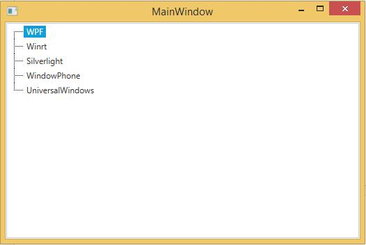

# Getting Started

This section explains how to create Tree layout using TreeViewAdv control

## Add TreeViewAdv

There are several ways to add Syncfusion control in to Visual Studio WPF project, the following steps will helps to add a TreeViewAdv control through XAML Code.

* Create a WPF project in Visual Studio and refer the following assemblies.
      1. Syncfusion.Tools.Wpf
      2. Syncfusion.Shared.Wpf
* Include an xml namespace for the above assemblies to the Main window.





<Window x:Class="WpfApplication1.MainWindow"

xmlns="http://schemas.microsoft.com/winfx/2006/xaml/presentation"

xmlns:x="http://schemas.microsoft.com/winfx/2006/xaml"

xmlns:syncfusion="http://schemas.syncfusion.com/wpf"

Title="MainWindow" Height="350" Width="525">

</Window>





* Now, Add the TreeViewAdv control, using the included namespace in XAML





<Window x:Class="WpfApplication1.MainWindow"

xmlns="http://schemas.microsoft.com/winfx/2006/xaml/presentation"

xmlns:x="http://schemas.microsoft.com/winfx/2006/xaml"

xmlns:syncfusion="http://schemas.syncfusion.com/wpf"

Title="MainWindow" Height="350" Width="525">

<Grid>

<syncfusion:TreeViewAdv x:Name="Tree">

</syncfusion:TreeViewAdv>

</Grid>

</Window>





## Adding TreeView Item to TreeViewAdv Control

The TreeviewItem is added to a TreeViewAdv control either by using XAML. The following code example lets you to create and add treeview items to the TreeViewAdv





<Window x:Class="WpfApplication1.MainWindow"

xmlns="http://schemas.microsoft.com/winfx/2006/xaml/presentation"

xmlns:x="http://schemas.microsoft.com/winfx/2006/xaml"

xmlns:syncfusion="http://schemas.syncfusion.com/wpf"

Title="MainWindow" Height="350" Width="525">

<Grid>

<syncfusion:TreeViewAdv x:Name="Tree">

<syncfusion:TreeViewItemAdv Header="WPF" />

<syncfusion:TreeViewItemAdv Header="Winrt" />

<syncfusion:TreeViewItemAdv Header="Silverlight" />

<syncfusion:TreeViewItemAdv Header="WindowPhone" />

<syncfusion:TreeViewItemAdv Header="UniversalWindows" />

</syncfusion:TreeViewAdv>

</Grid>

</Window>





## Set VisualStyle

Ribbon supports various visual styles by using the SkinStorage. To apply Visual Studio style on the current layout, refer the below code to apply the value Metro to the VisualStyle property of the SkinStorage for the Window





<Window x:Class="WpfApplication1.MainWindow"

xmlns="http://schemas.microsoft.com/winfx/2006/xaml/presentation"

xmlns:x="http://schemas.microsoft.com/winfx/2006/xaml"

xmlns:syncfusion="http://schemas.syncfusion.com/wpf"

syncfusion:SkinStorage.VisualStyle="Metro"

Title="MainWindow" Height="350" Width="525">

<Grid>

<syncfusion:TreeViewAdv x:Name="Tree">

<syncfusion:TreeViewItemAdv Header="WPF" />

<syncfusion:TreeViewItemAdv Header="Winrt" />

<syncfusion:TreeViewItemAdv Header="Silverlight" />

<syncfusion:TreeViewItemAdv Header="WindowPhone" />

<syncfusion:TreeViewItemAdv Header="UniversalWindows"/>

</syncfusion:TreeViewAdv>

</Grid>

</Window>





## Setting ItemsSource for TreeviewAdv

The following code snippet sets a collection used to generate the Items of the TreeViewAdv control.





<Window x:Class="WpfApplication1.MainWindow"

xmlns="http://schemas.microsoft.com/winfx/2006/xaml/presentation"

xmlns:x="http://schemas.microsoft.com/winfx/2006/xaml"

xmlns:syncfusion="http://schemas.syncfusion.com/wpf"

syncfusion:SkinStorage.VisualStyle="Metro"

xmlns:local="clr-namespace:WpfApplication1"

Title="MainWindow" Height="350" Width="525">

<Window.Resources>

<local:TechnologyList x:Key="technologyList" />

</Window.Resources>

<Grid>

<syncfusion:TreeViewAdv x:Name="Tree" ItemsSource="{StaticResource technologyList}" >

</syncfusion:TreeViewAdv>

</Grid>

</Window>









public class TechnologyList : ObservableCollection<string>

{

public TechnologyList()

{

this.Add("WPF");

this.Add("Winrt");

this.Add("Silverlight");

this.Add("WindowPhone");

this.Add("UniversalWindows");

}

}





Public Class TechnologyList
	Inherits ObservableCollection(Of String)

Public Sub New()

Me.Add("WPF")

Me.Add("Winrt")

Me.Add("Silverlight")

Me.Add("WindowPhone")

Me.Add("UniversalWindows")

End Sub

End Class



  

