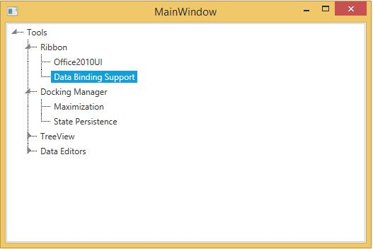
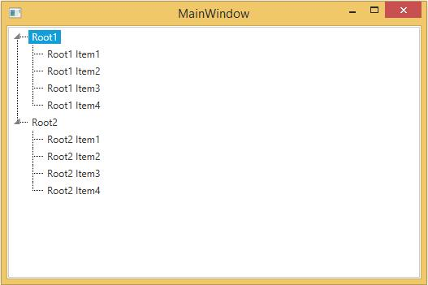

# Populating with Data

This section explains about populating TreeViewAdv with TreeView items using several ways.

* Through XAML
* Through Programmatically
* Through DataBinding
## Through XAML

TreeViewAdv can be created in XAML as follows:




<syncfusion:TreeViewAdv>

<syncfusion:TreeViewItemAdv Header="Root1">

<syncfusion:TreeViewItemAdv Header="SubItem1"/>

<syncfusion:TreeViewItemAdv Header="SubItem2"/>

<syncfusion:TreeViewItemAdv Header="SubItem2"/>

<syncfusion:TreeViewItemAdv Header="SubItem2"/>

</syncfusion:TreeViewItemAdv>

<syncfusion:TreeViewItemAdv Header="Root2">

<syncfusion:TreeViewItemAdv Header="SubItem1"/>

<syncfusion:TreeViewItemAdv Header="SubItem2"/>

<syncfusion:TreeViewItemAdv Header="SubItem2"/>

<syncfusion:TreeViewItemAdv Header="SubItem2"/>

</syncfusion:TreeViewItemAdv>

</syncfusion:TreeViewAdv>





## Through Programmatically

Include the following namespace to the using directives list to create TreeViewAdv in 




using Syncfusion.Windows.Tools.Controls;









You can create the TreeViewAdv as follows:




TreeViewAdv treeviewAdv = new TreeViewAdv();

TreeViewItemAdv root1 = new TreeViewItemAdv() { Header = "Root1" };

TreeViewItemAdv subitem11 = new TreeViewItemAdv() { Header = "SubItem1" };

TreeViewItemAdv subitem12 = new TreeViewItemAdv() { Header = "SubItem2" };

TreeViewItemAdv subitem13 = new TreeViewItemAdv() { Header = "SubItem3" };

TreeViewItemAdv subitem14 = new TreeViewItemAdv() { Header = "SubItem4" };

root1.Items.Add(subitem11);

root1.Items.Add(subitem12);

root1.Items.Add(subitem13);

root1.Items.Add(subitem14);

TreeViewItemAdv root2 = new TreeViewItemAdv() { Header = "Root1" };

TreeViewItemAdv subitem21 = new TreeViewItemAdv() { Header = "SubItem1" };

TreeViewItemAdv subitem22 = new TreeViewItemAdv() { Header = "SubItem2" };

TreeViewItemAdv subitem23 = new TreeViewItemAdv() { Header = "SubItem3" };

TreeViewItemAdv subitem24 = new TreeViewItemAdv() { Header = "SubItem4" };

root2.Items.Add(subitem21);

root2.Items.Add(subitem22);

root2.Items.Add(subitem23);

root2.Items.Add(subitem24);

treeviewAdv.Items.Add(root1);

treeviewAdv.Items.Add(root2);

//TreeViewAdv added the child of grid.

layout.Children.Add(treeviewAdv);









## Through DataBinding

DataBinding is a powerful mechanism to auto-update data between the business model and the user interface.

### Binding to XML

XML file can also be used as ItemsSource for the TreeViewAdv. The following example illustrates this:

1. Create the xml file with the following details and name it as Data.xml:




<Products>

<Product Name="Tools" >

<Feature Name="Ribbon" >

<Feature Name="Office2010UI"/>

<Feature Name="Data Binding Support"/>

</Feature>

<Feature Name="Docking Manager">

<Feature Name="Maximization"/>

<Feature Name="State Persistence"/>

</Feature>

<Feature Name="TreeView">

<Feature Name="Editing"/>

<Feature Name="Sorting"/>

</Feature>

<Feature Name="Data Editors" >

<Feature Name="Watermark Text" />

<Feature Name="Extended Value Scrolling" />

</Feature>

</Product>

</Products>





2. Add the XmlDataProvider for the above XML document as follows:




<Window.Resources>

<XmlDataProvider Source="Data.xml" x:Key="xmlSource" XPath="Products"/>

</Window.Resources>





3. Set the ItemsSource property for the TreeViewAdv as follows:




<syncfusion:TreeViewAdv ItemsSource="{Binding Source={StaticResource xmlSource}, XPath=Product}" >

<syncfusion:TreeViewAdv.ItemTemplate>

<HierarchicalDataTemplate ItemsSource="{Binding XPath=Feature}">

<TextBlock Text="{Binding XPath=@Name}" />

</HierarchicalDataTemplate>

</syncfusion:TreeViewAdv.ItemTemplate>

</syncfusion:TreeViewAdv>





4. TreeViewAdv will be created as follows:

### Binding to Object

TreeViewAdv supports object binding. The following example illustrates data binding:

1. Create a class that acts as a model for TreeViewAdv as given in the following code snippet:




public class Model

{

public Model()

{

SubItems = new ObservableCollection<Model>();

}

public string Header { get; set; }

public bool IsCheckable { get; set; }

public ObservableCollection<Model> SubItems { get; set; }

}









2. Create a ViewModel class and initialize the items as given in the following code snippet:




public class ViewModel

{

public ViewModel()

{

TreeItems = new ObservableCollection<Model>();

PopulateData();

}

public ObservableCollection<Model> TreeItems { get; set; }

private void PopulateData()

{

Model Root1 = new Model() { Header = "Root1" };

PopulateSubItems(Root1);

TreeItems.Add(Root1);

Model Root2 = new Model() { Header = "Root2" };

PopulateSubItems(Root2);

TreeItems.Add(Root2);

}

private void PopulateSubItems(Model Root)

{

Model SubItem1 = new Model() { Header = Root.Header + " Item1" };

Model SubItem2 = new Model() { Header = Root.Header + " Item2" };

Model SubItem3 = new Model() { Header = Root.Header + " Item3" };

Model SubItem4 = new Model() { Header = Root.Header + " Item4" };

Root.SubItems.Add(SubItem1);

Root.SubItems.Add(SubItem2);

Root.SubItems.Add(SubItem3);

Root.SubItems.Add(SubItem4);

}

}









3. Create a ViewModel instance and use it as DataContext for the Root Window as given in the following code snippet:




<Window.DataContext>

<local:ViewModel />

</Window.DataContext>





4. Configure the ItemsSource and ItemTemplate of the TreeViewAdv as given below:




<syncfusion:TreeViewAdv ItemsSource="{Binding TreeItems}">

<syncfusion:TreeViewAdv.ItemTemplate>

<HierarchicalDataTemplate ItemsSource="{Binding SubItems}">

<TextBlock Text="{Binding Header}" />

</HierarchicalDataTemplate>

</syncfusion:TreeViewAdv.ItemTemplate>

</syncfusion:TreeViewAdv>





5. The TreeViewAdv will be created as follows:

### Binding to WCF

