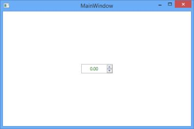

# Getting Started

This section explains how to add **UpDown** control to an application and its structure.

## Assembly deployment

Refer to the [control dependencies](https://help.syncfusion.com/wpf/control-dependencies#updown) section to get the list of assemblies or NuGet package that needs to be added as a reference to use the control in any application.

[Click here](https://help.syncfusion.com/wpf/visual-studio-integration/nuget-packages) to find more details on how to install nuget packages in WPF application.

## Adding the UpDown control via designer

The [UpDown](https://help.syncfusion.com/cr/wpf/Syncfusion.Shared.Wpf~Syncfusion.Windows.Shared.UpDown.html) control can be added to an application by dragging it from the toolbox to design view. The following dependent assemblies will be added automatically.

* Syncfusion.Shared.WPF

## Adding the UpDown control via XAML

There are several ways to add Syncfusion control in to the Visual Studio WPF project. The following code example illustrates how to add the [UpDown](https://help.syncfusion.com/cr/wpf/Syncfusion.Shared.Wpf~Syncfusion.Windows.Shared.UpDown.html) control to an application through XAML.

1) Create a new WPF project in Visual Studio.

2) Add the following required assembly reference to the project.

* Syncfusion.Shared.WPF

3) Include an XML namespace for the above assembly to the main window.





<Window x:Class="Application_New.MainWindow"
xmlns="http://schemas.microsoft.com/winfx/2006/xaml/presentation"
xmlns:x="http://schemas.microsoft.com/winfx/2006/xaml"
xmlns:syncfusion="http://schemas.syncfusion.com/wpf"    
Title="MainWindow" Height="350" Width="525">





4) Now, Add the [UpDown](https://help.syncfusion.com/cr/wpf/Syncfusion.Shared.Wpf~Syncfusion.Windows.Shared.UpDown.html) control with a required optimal name by using the included namespace.





<syncfusion:UpDown Name="_upDown" Width="100" Height="23"/>





## Adding the UpDown control via C#

The following code example illustrates how to add the **UpDown** control to an application through C#.

1) Create a C# or VB application via Visual Studio.

2) Add the following required assembly reference to the project.

* Syncfusion.Shared.WPF

3) Create an instance of [UpDown](https://help.syncfusion.com/cr/wpf/Syncfusion.Shared.Wpf~Syncfusion.Windows.Shared.UpDown.html) control and add it to the main window.





UpDown updown = new UpDown();
updown.Width = 100;
updown.Height = 23;
Grid1.Children.Add(updown);





## Structure of UpDown

The following are the elements of the UpDown control:

* **Text area** - It is the area where the numeric values are displayed. 
* **Increment button** - It is a repeat button that can be clicked to increment the current value of the UpDown control.
* **Decrement button** - It is a repeat button that can be clicked to decrement the current value of the UpDown control.

## Value

The value of **UpDown** control can be changed by [Value](https://help.syncfusion.com/cr/wpf/Syncfusion.Shared.Wpf~Syncfusion.Windows.Shared.UpDown~Value.html) property. A value can be set for the UpDown control as shown in the following code example.





<syncfusion:UpDown Name="_upDown" Height="23" Value="10" Width="85"/>





updown.Value = 10;





### Step Value

The [Step](https://help.syncfusion.com/cr/wpf/Syncfusion.Shared.Wpf~Syncfusion.Windows.Shared.UpDown~Step.html) property is used to specify the interval to be incremented or decremented in the UpDown control when the repeat buttons are clicked.





<syncfusion:UpDown Name="_upDown" Height="25" Step="5"  Width="90" />





updown.Step = 5;





## Culture

The culture can be set to `en-US` for the UpDown control as shown in the following code. The U.S. culture uses "." as the decimal seperator.





<syncfusion:UpDown Name="_upDown" Height="25" Step="4" Culture="en-US" Width="90" />





CultureInfo cultureInfo = new CultureInfo("en-US");
updown.Culture = cultureInfo;





## Number formatting

You can set the format of number changes in UpDown control by using [NumberFormatInfo](https://help.syncfusion.com/cr/wpf/Syncfusion.Shared.Wpf~Syncfusion.Windows.Shared.UpDown~NumberFormatInfo.html) property.





<syncfusion:UpDown Name="_upDown" Height="25" NumberDecimalDigits="5" Width="90" />





up.NumberDecimalDigits = 5;





