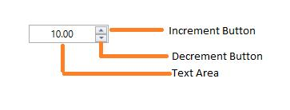

# Getting Started

This section explains how to add `UpDown` control to an application and its structure.

## Add UpDown control to an Application

The `UpDown` control can be added to an application by using the following ways.

### Create the UpDown Control by using XAML

There are several ways to add Syncfusion control in to the Visual Studio WPF project. The following code example illustrates how to add the `UpDown` control to an application through XAML.

* Create a WPF project in Visual Studio and refer “Syncfusion.Shared.Wpf” assembly to the project.    
* Include an xml namespace for the above assemblies to the Main window.





<Window x:Class="Application_New.MainWindow"

xmlns="http://schemas.microsoft.com/winfx/2006/xaml/presentation"

xmlns:x="http://schemas.microsoft.com/winfx/2006/xaml"

xmlns:syncfusion="http://schemas.syncfusion.com/wpf"    

Title="MainWindow" Height="350" Width="525">





* Now add the `UpDown` control with a required optimal name by using the included namespace




<syncfusion:UpDown Name="_upDown" Width="100" Height="23"/>





###  Create the UpDown Control by using C#:

The following code example illustrates how to add the `UpDown` control to an application through C#.





UpDown updown = new UpDown();

updown.Width = 100;

updown.Height = 23;

Grid1.Children.Add(updown);





## Structure

The following are the elements of the `UpDown` control:

* **Text** **area** - It is the area where the numeric values are displayed. 
* **Increment** **button** - It is a repeat button that can be clicked to increment the current value of the `UpDown` control.
* **Decrement** **button** - It is a repeat button that can be clicked to decrement the current value of the `UpDown` control.
