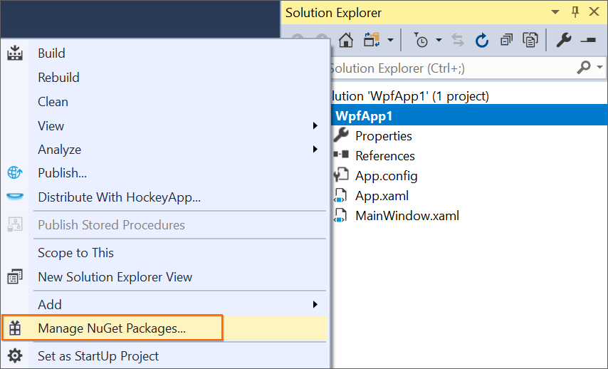
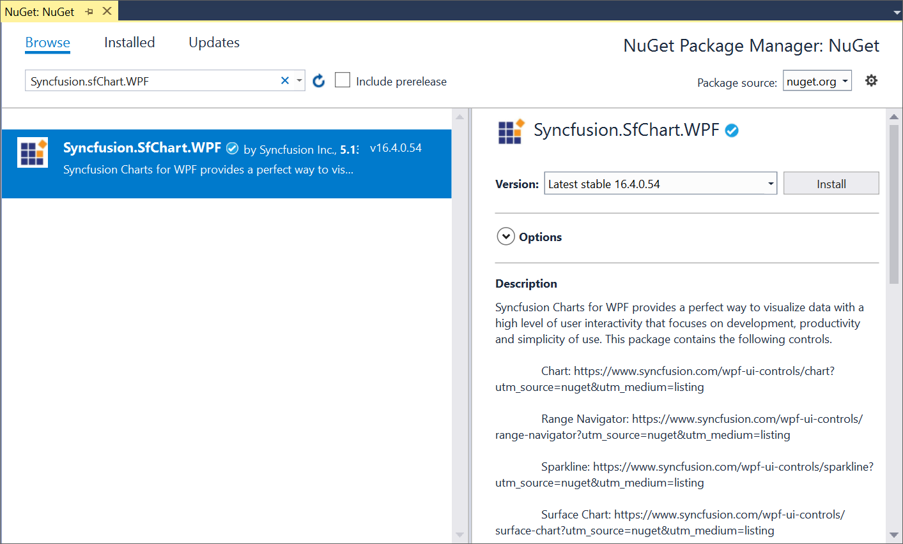
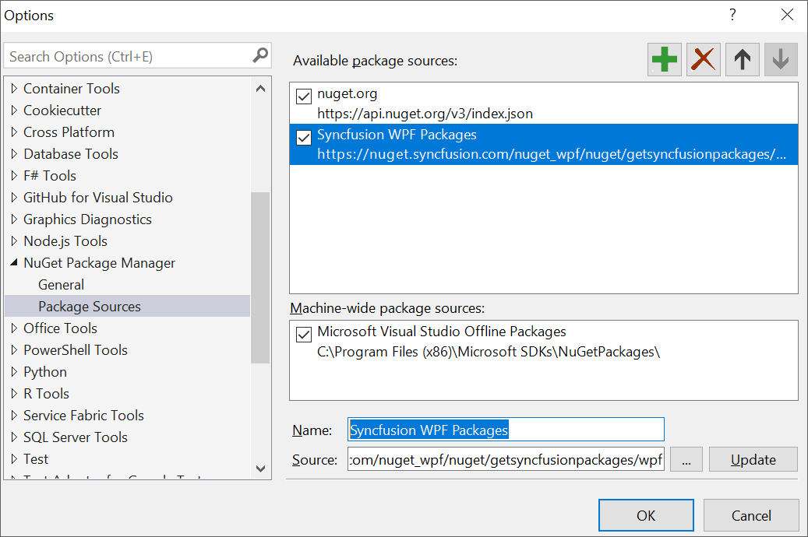

# NuGet Packages

[NuGet](https://www.nuget.org/) can be used to automatically add files and references to your Visual Studio projects. You can use the Syncfusion WPF NuGet packages without installing the Essential Studio or WPF platform installation to development with the Syncfusion WPF controls. 

From v16.2.0.46 (2018 Volume 2 Service Pack 1) onwards, all the Syncfusion components are available as NuGet packages at [nuget.org](https://www.nuget.org/profiles/SyncfusionInc). 

Starting with v16.2.0.x, if you reference Syncfusion assemblies from trial setup or from the NuGet package, you must include a license key in your projects. Refer to this [link](https://help.syncfusion.com/common/essential-studio/licensing/license-key) to learn about registering Syncfusion license key in your WPF application to use Syncfusion controls.

N> Starting from v17.1.0.32 (2018 Volume 1), Syncfusion will no longer publish NuGet packages at [nuget.syncfusion.com](https://nuget.syncfusion.com/).

## Installing NuGet Packages

### Using NuGet Package Manager

The NuGet Package Manager can be used to search and install NuGet packages in the Visual Studio solution or project:

1.	Right-click the project or solution in the Solution Explorer tab, and choose **Manage NuGet Packages…**

    

    Alternatively, click **Tools** menu, `NuGet Package Manager | Manage NuGet Packages for Solution...`

2.	Select the NuGet.org from the Package source drop-down. 

                 

3.	All the Syncfusion NuGet Packages are listed and available. Search and install the required packages in your application, by clicking the **Install** button.

N> The Syncfusion NuGet packages are published in public [NuGet.org](https://www.nuget.org/) from v16.2.0.46. To Install earlier version of 16.2.0.46 Syncfusion NuGet packages, [configure Syncfusion private feed URL](https://help.syncfusion.com/wpf/Visual-Studio-Integration/nuget-packages#syncfusion-nuget-feed-url-configuration).

### Using Package Manager Console

To reference the Syncfusion WPF component using the Package Manager Console as NuGet packages, follow the below steps:  

1.	On the **Tools** menu, select **NuGet Package Manager** and then **Package Manager Console**. 

2.	Run the following NuGet installation commands. 

    ~~~
    #install specified package in default project
    Install-Package <Package Name>

    #install specified package in specified project 
    Install-Package <Package Name> - ProjectName <Project Name>
    ~~~

    **For example:**

    ~~~
    #install specified package in default project
    Install-Package Syncfusion.SfChart.WPF

    #install specified package in specified project 
    Install-Package Syncfusion.SfChart.WPF -ProjectName SyncfusionDemoApplication
    ~~~

## Managing NuGet package using NuGet CLI

The NuGet Command Line Interface (CLI), nuget.exe, provides the full extent of NuGet functionality to install, create, publish, and manage packages without making any change to the project files.

1.	Download the latest NuGet CLI [here](https://dist.nuget.org/win-x86-commandline/latest/nuget.exe).

    N> To update the existing nuget.exe to latest version use the following command:

    ~~~
    nuget update -self
    ~~~

2.  Open the downloaded executable location in the command window, and run the following commands to download and install the required NuGet packages to a project specified in the package.config. 

    ~~~
    #install specified package in default project from specified Package Source 
    nuget.exe install <Package name | ConfigFilePath > [Options]
    ~~~

    N> configPath is optional. This identifies the packages.config or solutions file that lists the packages utilized in the project. 

    **For example:**

    ~~~
    #install specific package 
    nuget.exe install “Syncfusion.SfChart.WPF"

    #install all package which mention in package.config path 
    nuget.exe install “C:\Users\SyncfusionApplication\package.config”
    ~~~

N> To Install earlier version of 16.2.0.46 Syncfusion NuGet packages, [configure Syncfusion private feed URL](https://help.syncfusion.com/wpf/Visual-Studio-Integration/nuget-packages#syncfusion-nuget-feed-url-configuration).

## Upgrading NuGet packages

### Using NuGet Package Manger 

NuGet packages can be updated to their specific version or latest version available in the Visual Studio solution or project.

1. Right-click the project or solution in the Solution Explorer tab, and choose **Manage NuGet Packages…**
   Alternatively, click **Tools** menu, `NuGet Package Manager | Manage NuGet Packages for Solution...`

2. Select the **Updates** tab to see the packages available for update from the desired package sources. Select the required packages and the specific version from the dropdown, and click the **Update** button.

### Using Package Manger Console

To update the installed Syncfusion WPF NuGet packages using the Package Manager Console, follow the below steps:  

1.	On the **Tools** menu, select **NuGet Package Manager**, and then **Package Manager Console.** 

2.	Run the following NuGet installation commands.

    ~~~ 
    #Update specific NuGet package in default project
    Update-Package <Package Name>

    #Update all the packages in default project
    Update-Package 

    #Update specified package in specified project 
    Update-Package <Package Name> - ProjectName <Project Name>
    ~~~

    **For example:**

    ~~~
    #Update specified Syncfusion WPF NuGet package 
    Update-Package Syncfusion.SfChart.WPF

    #Update specified package in specified project 
    Update-Package Syncfusion.SfChart.WPF -ProjectName SyncfusionDemoApplication
    ~~~

### Using NuGet CLI

Using the NuGet CLI, all the NuGet packages in the project can be updated to the available latest version. 

1.	Download the latest NuGet CLI [here](https://dist.nuget.org/win-x86-commandline/latest/nuget.exe).

    N> To update the existing nuget.exe to latest version use the following command. 
    
    ~~~
    nuget update -self
    ~~~

2.	Open the downloaded executable location in the command window. Run the following “update commands” to update the Syncfusion WPF NuGet packages.

    ~~~ 
    #update all NuGet packages from config file
    nuget update <configPath> [options]

    #update all NuGet packages
    nuget update
    ~~~      

    N> configPath is optional. This identifies the packages.config or solutions file lists the packages utilized in the project. 
	
    **For example:**
    
    ~~~          
    #Update all NuGet packages from config file
    nuget update “C:\Users\SyncfusionApplication\package.config”
    ~~~

## Syncfusion NuGet feed URL Configuration

### Get the Syncfusion NuGet feed URL 

You should get the private Syncfusion WPF NuGet feed URL to install or upgrade the Syncfusion WPF NuGet packages. To get the URL from Syncfusion website use the following steps:

1. Navigate to [nuget.syncfusion.com](https://nuget.syncfusion.com/), and select the **DESKTOP** tab.     

2. Click the Copy URL label under WPF platform to copy the Syncfusion WPF platform NuGet feed to clipboard or directly use the following URL: 

    [https://nuget.syncfusion.com/nuget_wpf/nuget/getsyncfusionpackages/wpf](https://nuget.syncfusion.com/nuget_wpf/nuget/getsyncfusionpackages/wpf) 

    

3. Now, use this NuGet feed URL to access the Syncfusion NuGet Packages in Visual Studio. 

### Add the Syncfusion NuGet feed URL

#### Windows

1.	Open your Visual Studio application. 

2.	On the **Tools** menu, select **Options**.

3.	Expand the **NuGet Package Manager** and select **Package Sources**.

4.	Click the **Add** button (green plus), and enter the ‘Package Name’ and ‘Package Source URL’ of the Syncfusion WPF NuGet packages.

    **Name:** Name of the package listed in the available package sources.
    **Source:** Syncfusion WPF NuGet Feed URL      
    [https://nuget.syncfusion.com/nuget_wpf/nuget/getsyncfusionpackages/wpf](https://nuget.syncfusion.com/nuget_wpf/nuget/getsyncfusionpackages/wpf).

5.	Click the **Update** button to add the name and source details to package sources. 

    

#### NuGet CLI 

1.	Download the latest NuGet CLI [here](https://dist.nuget.org/win-x86-commandline/latest/nuget.exe).

    N> To update the existing nuget.exe to latest version use the following command:

    ~~~
    nuget update -self
    ~~~

2.	Open the downloaded executable location in the command window, and run the following commands to configure the Syncfusion WPF NuGet packages: 

    ~~~
    #Add specified Package Source in NuGet.config file 
    nuget.exe Sources Add –Name <Source name> –Source <Source location>  
    ~~~

    **For example:**

    ~~~
    nuget.exe Sources Add –Name “Syncfusion Source” –Source “https://nuget.syncfusion.com/nuget_wpf/nuget/getsyncfusionpackages/wpf”
    ~~~

