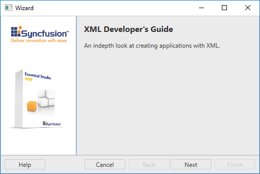
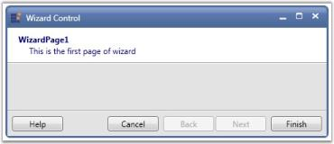
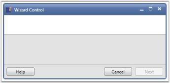

# Interactive Features

This section illustrates the following interactive feature of [Wizard Control](https://help.syncfusion.com/cr/cref_files/wpf/Syncfusion.Tools.Wpf~Syncfusion.Windows.Tools.Controls.WizardControl.html). 

## Populating pages in Wizard Control

The pages can be added to [Wizard Control](https://help.syncfusion.com/cr/cref_files/wpf/Syncfusion.Tools.Wpf~Syncfusion.Windows.Tools.Controls.WizardControl.html) by following ways,

* Populating by Wizard Pages
* Populating by Data Binding

## Populating by Wizard Pages

You can add any number of [wizard pages](https://help.syncfusion.com/cr/cref_files/wpf/Syncfusion.Tools.Wpf~Syncfusion.Windows.Tools.Controls.WizardPage.html) to the [Wizard Control](https://help.syncfusion.com/cr/cref_files/wpf/Syncfusion.Tools.Wpf~Syncfusion.Windows.Tools.Controls.WizardControl.html) and there are plenty of properties in the Wizard control that are used to customize the appearance and function of the wizard pages.





<syncfusion:WizardControl Name="wizardControl">
    <syncfusion:WizardPage Name="wizardPage1"/>
    <syncfusion:WizardPage Name="wizardPage2"/>
</syncfusion:WizardControl>





WizardControl wizardControl = new WizardControl();

WizardPage wizardPage1 = new WizardPage();

WizardPage wizardPage2 = new WizardPage();

wizardControl.Items.Add(wizardPage1);     

wizardControl.Items.Add(wizardPage2);





## Populating by Data Binding

Below steps will explain on how to add the Items through [ItemsSource](https://help.syncfusion.com/cr/cref_files/wpf/Syncfusion.Tools.Wpf~Syncfusion.Windows.Tools.Controls.WizardControl_members.html#) property of [Wizard Control](https://help.syncfusion.com/cr/cref_files/wpf/Syncfusion.Tools.Wpf~Syncfusion.Windows.Tools.Controls.WizardControl.html).

1.Create a Model class with the necessary properties.



public class Model : NotificationObject
{
    private string title;

    public string Title
    {
        get
        {
            return title;
        }
        set
        {
            title = value;
            RaisePropertyChanged("Title");
        }
    }

    private string content;

    public string Content
    {
        get
        {
            return content;
        }
        set
        {
            content = value;
            RaisePropertyChanged("Description");
        }
    }
}



2.Create collection of PageItems in ViewModel class to populate pages.



private ObservableCollection<Model> items;

public ObservableCollection<Model> PageItems
{
    get
    {
        return items;
    }

    set
    {
        items = value;
        RaisePropertyChanged("PageItems");
    }
}



3.Populate the PageItems collection as follows.



private void PopulatePageItems()
{

    items.Add(new Model { Title = "XML Developer's Guide", Content = "An in-depth look at creating applications with XML." });

    items.Add(new Model { Title = "Midnight Rain", Content = "A former architect battles corporate zombies, an evil sorceress, and her own childhood to become queen of the world." });

    items.Add(new Model { Title = "Oberon's Legacy", Content = "In post apocalypse England, the mysterious agent known only as Oberon helps to create a new life for the inhabitants of London." });

    items.Add(new Model { Title = "Lover Birds", Content = "When Carla meets Paul at an ornithology conference, tempers fly as feathers get ruffled." });

    items.Add(new Model { Title = "Science Fiction", Content = "After an inadvertent trip through a Heisenberg Uncertainty Device, James discovers the problems of being quantum." });

}



4.Create a ViewModel instance and use it as DataContext for the Root Window.



<Window.DataContext>
    <local:ViewModel/>
</Window.DataContext>    



5.Bind the PageItems collection to the [ItemsSource](https://help.syncfusion.com/cr/cref_files/wpf/Syncfusion.Tools.Wpf~Syncfusion.Windows.Tools.Controls.WizardControl_members.html#) property of the WizardControl. Content of the WizardPage can be displayed using the [ItemTemplate](https://help.syncfusion.com/cr/cref_files/wpf/Syncfusion.Tools.Wpf~Syncfusion.Windows.Tools.Controls.WizardControl_members.html#) property.



<Window.DataContext>
    <local:ViewModel/>
</Window.DataContext>
    
<Window.Resources>
    
</Window.Resources>
    
<Grid>
<syncfusion:WizardControl x:Name="wizardcontrol" ItemContainerStyle="{StaticResource WizardPageStyle}" ItemsSource="{Binding PageItems}">
    <syncfusion:WizardControl.ItemTemplate>
        <DataTemplate>
            <TextBlock Text="{Binding Content}" TextWrapping="Wrap"/>
        </DataTemplate>
    </syncfusion:WizardControl.ItemTemplate>
</syncfusion:WizardControl>
</Grid>



N> [ViewSample in GitHub](https://github.com/SyncfusionExamples/Populating-WPF-wizard-control-by-DataBinding).

### Selecting an Wizard Page 

[SelectedWizardPage](https://help.syncfusion.com/cr/cref_files/wpf/Syncfusion.Tools.Wpf~Syncfusion.Windows.Tools.Controls.WizardControl~SelectedWizardPage.html) property is used to select the wizard page from the WizardControl. Since the type of [SelectedWizardPage](https://help.syncfusion.com/cr/cref_files/wpf/Syncfusion.Tools.Wpf~Syncfusion.Windows.Tools.Controls.WizardControl~SelectedWizardPage.html) is WizardPage, binding is needed to set selected wizard page through XAML. The following code explains how to select the wizard page in XAML and in C#,





<syncfusion:WizardControl Name="WizardControl" SelectedWizardPage="{Binding ElementName=wizard2}" Foreground="SlateBlue">
    <syncfusion:WizardPage Title="Wizard Page1" x:Name="wizard1"/>
    <syncfusion:WizardPage Title="Wizard Page2" x:Name="wizard2"/>
    <syncfusion:WizardPage Title="Wizard Page3" x:Name="wizard3"/>
</syncfusion:WizardControl>









//Initializing the Wizard control
WizardControl wizardControl = new WizardControl();

//Creating Wizard pages
WizardPage wizardPage1 = new WizardPage();

WizardPage wizardPage2 = new WizardPage();

WizardPage wizardPage3 = new WizardPage();

wizardControl.Foreground = Brushes.SlateBlue;

wizardPage1.Title = "Wizard Page1";

wizardPage2.Title = "Wizard Page2";

wizardPage3.Title = "Wizard Page3";

wizardControl.Items.Add(wizardPage1);

wizardControl.Items.Add(wizardPage2);

wizardControl.Items.Add(wizardPage3);

wizardControl.SelectedWizardPage = wizardPage2;





### Title and Description

You can set the title and description for the [wizard page](https://help.syncfusion.com/cr/cref_files/wpf/Syncfusion.Tools.Wpf~Syncfusion.Windows.Tools.Controls.WizardPage.html) by using the [Title](https://help.syncfusion.com/cr/cref_files/wpf/Syncfusion.Tools.Wpf~Syncfusion.Windows.Tools.Controls.WizardPage~Title.html) and [Description](https://help.syncfusion.com/cr/cref_files/wpf/Syncfusion.Tools.Wpf~Syncfusion.Windows.Tools.Controls.WizardPage~Description.html) properties respectively.





<syncfusion:WizardControl Name="wizardControl">
    <syncfusion:WizardPage Name="wizardPage" Foreground="Navy" Title="WizardPage1" Description="This is the first page of wizard" />
</syncfusion:WizardControl>





WizardControl wizardControl = new WizardControl();

WizardPage wizardPage = new WizardPage();

wizardControl.Items.Add(wizardPage);

wizardPage.Foreground = Brushes.Navy;

wizardPage.Title = "WizardPage1";

wizardPage.Description = "This is the first page of wizard";





## Wizard Page Type

You can set the type of the [WizardPage](https://help.syncfusion.com/cr/cref_files/wpf/Syncfusion.Tools.Wpf~Syncfusion.Windows.Tools.Controls.WizardPage.html) by using the [PageType](https://help.syncfusion.com/cr/cref_files/wpf/Syncfusion.Tools.Wpf~Syncfusion.Windows.Tools.Controls.WizardPage~PageType.html) property. There are three types of wizard pages.

* Blank
* Interior
* Exterior

The [PageType](https://help.syncfusion.com/cr/cref_files/wpf/Syncfusion.Tools.Wpf~Syncfusion.Windows.Tools.Controls.WizardPage~PageType.html) with Blank has no content or control in it.

The [PageType](https://help.syncfusion.com/cr/cref_files/wpf/Syncfusion.Tools.Wpf~Syncfusion.Windows.Tools.Controls.WizardPage~PageType.html) with Interior value has the BannerImage occupies the top position of page.

The [PageType](https://help.syncfusion.com/cr/cref_files/wpf/Syncfusion.Tools.Wpf~Syncfusion.Windows.Tools.Controls.WizardPage~PageType.html) with Exterior value has the BannerImage occupies the left position of the page.





<syncfusion:WizardControl Name="wizardControl">
    <syncfusion:WizardPage Name="wizardPage" PageType="Exterior"/>
</syncfusion:WizardControl>





WizardControl wizardControl = new WizardControl();

WizardPage wizardPage = new WizardPage();

wizardControl.Items.Add(wizardPage);

wizardPage.PageType = WizardPageType.Exterior; 





## Navigation Buttons of Wizard Page

This topic illustrates the following about Navigation buttons of [Wizard Page](https://help.syncfusion.com/cr/cref_files/wpf/Syncfusion.Tools.Wpf~Syncfusion.Windows.Tools.Controls.WizardPage_members.html),

* Enabling or Disabling the Navigation Buttons
* Showing or Hiding the Navigation Buttons
* Text for the Navigation Buttons

#### Enabling or Disabling the Navigation Buttons

You can enable or disable the Back, Cancel, Next and Finish navigation buttons in the wizard control and wizard page. This is done by using the [BackEnabled](https://help.syncfusion.com/cr/cref_files/wpf/Syncfusion.Tools.Wpf~Syncfusion.Windows.Tools.Controls.WizardPage~BackEnabled.html), [CancelEnabled](https://help.syncfusion.com/cr/cref_files/wpf/Syncfusion.Tools.Wpf~Syncfusion.Windows.Tools.Controls.WizardPage~CancelEnabled.html), [NextEnabled](https://help.syncfusion.com/cr/cref_files/wpf/Syncfusion.Tools.Wpf~Syncfusion.Windows.Tools.Controls.WizardPage~NextEnabled.html) and [FinishEnabled](https://help.syncfusion.com/cr/cref_files/wpf/Syncfusion.Tools.Wpf~Syncfusion.Windows.Tools.Controls.WizardPage~FinishEnabled.html) properties.





<syncfusion:WizardControl Name="wizardControl" BackEnabled="True" FinishEnabled="True"NextEnabled="True" CancelEnabled="True">
    <syncfusion:WizardPage Name="wizardPage"/>
</syncfusion:WizardControl>





WizardControl wizardControl = new WizardControl();

WizardPage wizardPage = new WizardPage();           

wizardControl.Items.Add(wizardPage);

wizardControl.NextEnabled = true;

wizardControl.BackEnabled = true;

wizardControl.FinishEnabled = true;

wizardControl.CancelEnabled = true;  





#### Showing or Hiding the Navigation Buttons

You can show or hide the Back, Cancel, Next, Help and Finish navigation buttons in the [Wizard Control](https://help.syncfusion.com/cr/cref_files/wpf/Syncfusion.Tools.Wpf~Syncfusion.Windows.Tools.Controls.WizardControl.html) and wizard page by using the [BackVisible](https://help.syncfusion.com/cr/cref_files/wpf/Syncfusion.Tools.Wpf~Syncfusion.Windows.Tools.Controls.WizardPage~BackVisible.html), [CancelVisible](https://help.syncfusion.com/cr/cref_files/wpf/Syncfusion.Tools.Wpf~Syncfusion.Windows.Tools.Controls.WizardPage~CancelVisible.html), [NextVisible](https://help.syncfusion.com/cr/cref_files/wpf/Syncfusion.Tools.Wpf~Syncfusion.Windows.Tools.Controls.WizardPage~NextVisible.html), [HelpVisible](https://help.syncfusion.com/cr/cref_files/wpf/Syncfusion.Tools.Wpf~Syncfusion.Windows.Tools.Controls.WizardPage~HelpVisible.html) and [FinishVisible](https://help.syncfusion.com/cr/cref_files/wpf/Syncfusion.Tools.Wpf~Syncfusion.Windows.Tools.Controls.WizardPage~FinishVisible.html) properties. 





<syncfusion:WizardControl Name="wizardControl" BackVisible="False" NextVisible="True" CancelVisible="True" HelpVisible="True" FinishVisible="False">
    <syncfusion:WizardPage Name="wizardPage"/>
</syncfusion:WizardControl>





WizardControl wizardControl = new WizardControl();

WizardPage wizardPage = new WizardPage();

wizardControl.Items.Add(wizardPage);

wizardControl.CancelVisible = true;

wizardControl.BackVisible = false;

wizardControl.FinishVisible = true;

wizardControl.NextVisible = true;

wizardControl.HelpVisible = true; 





#### Text for the Navigation Buttons

You can set custom text for the Back, Next, Finish, Help and Cancel navigation buttons in the [Wizard control](https://help.syncfusion.com/cr/cref_files/wpf/Syncfusion.Tools.Wpf~Syncfusion.Windows.Tools.Controls.WizardControl_members.html) by using the [BackText](https://help.syncfusion.com/cr/cref_files/wpf/Syncfusion.Tools.Wpf~Syncfusion.Windows.Tools.Controls.WizardControl~BackText.html), [NextText](https://help.syncfusion.com/cr/cref_files/wpf/Syncfusion.Tools.Wpf~Syncfusion.Windows.Tools.Controls.WizardControl~NextText.html), [FinishText](https://help.syncfusion.com/cr/cref_files/wpf/Syncfusion.Tools.Wpf~Syncfusion.Windows.Tools.Controls.WizardControl~FinishText.html), [HelpText](https://help.syncfusion.com/cr/cref_files/wpf/Syncfusion.Tools.Wpf~Syncfusion.Windows.Tools.Controls.WizardControl~HelpText.html) and [CancelText](https://help.syncfusion.com/cr/cref_files/wpf/Syncfusion.Tools.Wpf~Syncfusion.Windows.Tools.Controls.WizardControl~CancelText.html) properties.





<syncfusion:WizardControl Name="wizardControl" BackText="Previous" HelpText="Help" CancelText="Exit" FinishText="Finish" NextText="Next">
    <syncfusion:WizardPage Name="wizardPage"/>
</syncfusion:WizardControl>





WizardControl wizardControl = new WizardControl();

WizardPage wizardPage = new WizardPage();           

wizardControl.Items.Add(wizardPage);

wizardControl.NextText = "Next";

wizardControl.BackText = "Previous";

wizardControl.CancelText = "Exit";

wizardControl.HelpText = "Help";

wizardControl.FinishText = "Finish";





N> You can set custom text for the navigation buttons in the wizard control but not for the navigation buttons in the wizard page.

## Next Page and Previous Page Navigation

You can set the navigation to the Next and Previous pages of [WizardPage](https://help.syncfusion.com/cr/cref_files/wpf/Syncfusion.Tools.Wpf~Syncfusion.Windows.Tools.Controls.WizardPage_members.html) by using the [NextPage](https://help.syncfusion.com/cr/cref_files/wpf/Syncfusion.Tools.Wpf~Syncfusion.Windows.Tools.Controls.WizardPage~NextPage.html) and [PreviousPage](https://help.syncfusion.com/cr/cref_files/wpf/Syncfusion.Tools.Wpf~Syncfusion.Windows.Tools.Controls.WizardPage~PreviousPage.html) properties.







<syncfusion:WizardControl Name="wizardControl" >
    <syncfusion:WizardPage Name="wizardPage1" Title="page1"  NextPage="{Binding ElementName=wizardPage4}"/>
    <syncfusion:WizardPage Name="wizardPage2" Title="page2" PreviousPage="{Binding ElementName=wizardPage3}"/>
    <syncfusion:WizardPage Name="wizardPage3" Title="page3"/>
    <syncfusion:WizardPage Name="wizardPage4" Title="page4"/>
</syncfusion:WizardControl>



WizardControl wizardControl = new WizardControl();

WizardPage wizardPage1 = new WizardPage();

WizardPage wizardPage2 = new WizardPage();

WizardPage wizardPage3 = new WizardPage();

wizardControl.Foreground = Brushes.SlateBlue;

wizardPage1.Title = "Wizard Page1";

wizardPage2.Title = "Wizard Page2";

wizardPage3.Title = "Wizard Page3";

wizardControl.Items.Add(wizardPage1);

wizardControl.Items.Add(wizardPage2);

wizardControl.Items.Add(wizardPage3);

wizardPage1.NextPage = wizardPage3;

wizardPage3.PreviousPage = wizardPage1;  





## Closing the Wizard Window

You can close the [Wizard control](https://help.syncfusion.com/cr/cref_files/wpf/Syncfusion.Tools.Wpf~Syncfusion.Windows.Tools.Controls.WizardControl_members.html) window by clicking the Finish or Cancel button by enabling the [FinishButtonClosesWindow](https://help.syncfusion.com/cr/cref_files/wpf/Syncfusion.Tools.Wpf~Syncfusion.Windows.Tools.Controls.WizardControl~FinishButtonClosesWindow.html) or [CancelButtonCancelsWindow](https://help.syncfusion.com/cr/cref_files/wpf/Syncfusion.Tools.Wpf~Syncfusion.Windows.Tools.Controls.WizardControl~CancelButtonCancelsWindow.html) properties respectively.





<syncfusion:WizardControl Name="wizardControl" FinishButtonClosesWindow="True" CancelButtonCancelsWindow="True">
    <syncfusion:WizardPage Name="wizardPage"/>
</syncfusion:WizardControl>





WizardControl wizardControl = new WizardControl();

WizardPage wizardPage = new WizardPage();

wizardControl.Items.Add(wizardPage);

wizardControl.CancelButtonCancelsWindow = true;

wizardControl.FinishButtonClosesWindow = true;





## Event for Next Button in Wizard Control  

You can use the [Next](https://help.syncfusion.com/cr/cref_files/wpf/Syncfusion.Tools.Wpf~Syncfusion.Windows.Tools.Controls.WizardControl~Next_EV.html) event in [Wizard Control](https://help.syncfusion.com/cr/cref_files/wpf/Syncfusion.Tools.Wpf~Syncfusion.Windows.Tools.Controls.WizardControl_members.html) to perform any required operation when Next button is clicked.





<syncfusion:WizardControl Name="wizardControl" CancelEnabled="False" CancelVisible="False" Next="wizardControl_Next" FinishButtonClosesWindow="True" CancelButtonCancelsWindow="True" >
    <syncfusion:WizardPage Name="wizardPage1" Title="page1"  />
    <syncfusion:WizardPage Name="wizardPage2" Title="page2" />
    <syncfusion:WizardPage x:Name="wizardPage3" Title="page3"/>
    <syncfusion:WizardPage Name="wizardPage4" Title="page4"/>
</syncfusion:WizardControl>





private void wizardControl_Next(object sender, RoutedEventArgs e)
{
    var obj = sender as WizardControl;

    if (obj.CancelVisible != true && obj.CancelEnabled != true)
    {
        obj.SelectedWizardPage = wizardPage2;
    }
}





