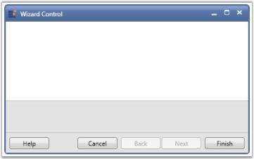
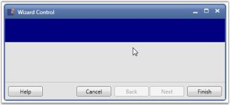

# Layout Related Features in WPF Wizard Control

This section illustrates the following Layout-related features of [Wizard Control](https://help.syncfusion.com/cr/wpf/Syncfusion.Windows.Tools.Controls.WizardControl.html).

## Setting the Minimum Height for the Interior Wizard Page Header

You can set the minimum height for the header of the Interior wizard page by using the [InteriorPageHeaderMinHeight](https://help.syncfusion.com/cr/wpf/Syncfusion.Windows.Tools.Controls.WizardControl.html#Syncfusion_Windows_Tools_Controls_WizardControl_InteriorPageHeaderMinHeight) property in [Wizard Control](https://help.syncfusion.com/cr/wpf/Syncfusion.Windows.Tools.Controls.WizardControl.html).





<syncfusion:WizardControl Name="wizardControl" InteriorPageHeaderMinHeight="150">
    <syncfusion:WizardPage Name="wizardPage" />
</syncfusion:WizardControl>





WizardControl wizardControl = new WizardControl();

WizardPage wizardPage = new WizardPage();

wizardControl.Items.Add(wizardPage);

wizardControl.InteriorPageHeaderMinHeight = 150; 





## Setting the Banner Background Color

You can set the background color of the banner for the [Wizard Control](https://help.syncfusion.com/cr/wpf/Syncfusion.Windows.Tools.Controls.WizardControl.html) by using the [BannerBackground](https://help.syncfusion.com/cr/wpf/Syncfusion.Windows.Tools.Controls.WizardPage.html#Syncfusion_Windows_Tools_Controls_WizardPage_BannerBackground) property. 





<syncfusion:WizardControl Name="wizardControl">
    <syncfusion:WizardPage Name="wizardPage" BannerBackground="Navy"/>
</syncfusion:WizardControl>





WizardControl wizardControl = new WizardControl();

WizardPage wizardPage = new WizardPage();

wizardControl.Items.Add(wizardPage);

wizardPage.BannerBackground = Brushes.Navy;





## Setting the Banner Image

You can set an image for the banner of the [Wizard Page](https://help.syncfusion.com/cr/wpf/Syncfusion.Windows.Tools.Controls.WizardPage.html) in  [Wizard Control](https://help.syncfusion.com/cr/wpf/Syncfusion.Windows.Tools.Controls.WizardControl.html)
 using the [BannerImage](https://help.syncfusion.com/cr/wpf/Syncfusion.Windows.Tools.Controls.WizardPage.html#Syncfusion_Windows_Tools_Controls_WizardPage_BannerImage) property.

N> You can set the banner image either on the interior or exterior wizard page based on the wizard page type.





<syncfusion:WizardControl Name="wizardControl">
    <syncfusion:WizardPage Name="wizardPage" BannerImage="/Image/sync.bmp"/>
</syncfusion:WizardControl>





WizardControl wizardControl = new WizardControl();

WizardPage wizardPage = new WizardPage();

wizardControl.Items.Add(wizardPage);

wizardPage.BannerImage = new BitmapImage(new Uri("/Image/sync.bmp", UriKind.RelativeOrAbsolute));  





## Setting Minimum Width for the Banner Image on the Exterior Wizard Page

You can set the minimum width of the banner image on the 'Exterior' wizard page by using the [ExteriorPageBannerImageMinWidth](https://help.syncfusion.com/cr/wpf/Syncfusion.Windows.Tools.Controls.WizardControl.html#Syncfusion_Windows_Tools_Controls_WizardControl_ExteriorPageBannerImageMinWidth) property in [Wizard Control](https://help.syncfusion.com/cr/wpf/Syncfusion.Windows.Tools.Controls.WizardControl.html).





<syncfusion:WizardControl Name="wizardControl" ExteriorPageBannerImageMinWidth="10">
    <syncfusion:WizardPage Name="wizardPage" PageType="Exterior" BannerImage="/Image/sync.bmp"/>
</syncfusion:WizardControl>





WizardControl wizardControl = new WizardControl();

grid.Children.Add(wizardControl);

WizardPage wizardPage = new WizardPage();

wizardControl.Items.Add(wizardPage);

wizardPage.BannerImage = new BitmapImage(new Uri("/Image/sync.bmp", UriKind.RelativeOrAbsolute));

wizardPage.PageType = WizardPageType.Exterior;

wizardControl.ExteriorPageBannerImageMinWidth = 10;





## Theme

WizardControl supports various built-in themes. Refer to the below links to apply themes for the WizardControl,

  * [Apply theme using SfSkinManager](https://help.syncfusion.com/wpf/themes/skin-manager)
	
  * [Create a custom theme using ThemeStudio](https://help.syncfusion.com/wpf/themes/theme-studio#creating-custom-theme)

 
