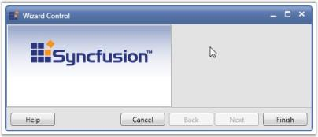

# Layout Related Features

This section illustrates the following Layout-related features of Wizard control.

## Setting the Minimum Height for the Interior Wizard Page Header

You can set the minimum height for the header of the Interior wizard page by using the InteriorPageHeaderMinHeight property.

Use the following code snippet for setting the minimum height for the page header.



<syncfusion:WizardControl Name="wizardControl" InteriorPageHeaderMinHeight="150">

    <syncfusion:WizardPage Name="wizardPage" />

</syncfusion:WizardControl>





WizardControl wizardControl = new WizardControl();

grid.Children.Add(wizardControl);

WizardPage wizardPage = new WizardPage();

wizardControl.Items.Add(wizardPage);

wizardControl.InteriorPageHeaderMinHeight = 150; 



See Also

Wizard Page Type

## Setting the Banner Background Color

Set the background color of the banner for the Wizard control by using the BannerBackground property. The following code snippet is used to set this property.



<syncfusion:WizardControl Name="wizardControl">

    <syncfusion:WizardPage Name="wizardPage" BannerBackground="Navy"/>

</syncfusion:WizardControl>




WizardControl wizardControl = new WizardControl();

grid.Children.Add(wizardControl);

WizardPage wizardPage = new WizardPage();

wizardControl.Items.Add(wizardPage);

wizardPage.BannerBackground = Brushes.Navy;



See Also

Banner Image

## Setting the Banner Image

Set an image for the banner of the Wizard control using the BannerImage property.

> Note: You can set the banner image either on the interior or exterior wizard page based on the wizard page type.

The following code snippet can be used to set the banner image.



<syncfusion:WizardControl Name="wizardControl">

    <syncfusion:WizardPage Name="wizardPage" BannerImage="/Image/sync.bmp"/>

</syncfusion:WizardControl>




WizardControl wizardControl = new WizardControl();

grid.Children.Add(wizardControl);

WizardPage wizardPage = new WizardPage();

wizardControl.Items.Add(wizardPage);

wizardPage.BannerImage = new BitmapImage(new Uri("/Image/sync.bmp", UriKind.RelativeOrAbsolute));  


See Also

Banner Background Color

## Setting Minimum Width for the Banner Image on the Exterior Wizard Page

You can set the minimum width of the banner image on the 'Exterior' wizard page by using the ExteriorPageBannerImageMinWidth property.

The following code snippet illustrates setting the minimum width for the banner image.



<syncfusion:WizardControl Name="wizardControl" ExteriorPageBannerImageMinWidth="10">

    <syncfusion:WizardPage Name="wizardPage" PageType="Exterior" BannerImage="/Image/sync.bmp"/>

</syncfusion:WizardControl>





WizardControl wizardControl = new WizardControl();

grid.Children.Add(wizardControl);

WizardPage wizardPage = new WizardPage();

wizardControl.Items.Add(wizardPage);

wizardPage.BannerImage = new BitmapImage(new Uri("/Image/sync.bmp", UriKind.RelativeOrAbsolute));

wizardPage.PageType = WizardPageType.Exterior;

wizardControl.ExteriorPageBannerImageMinWidth = 10;



See Also

Wizard Page Type

## Setting Visual Styles for Wizard Control

The appearance of the Wizard control can be customized by using the “VisualStyle” property. The following are the various built-in skins for Wizard Control:

* Blend
* Office2003
* Office2007Blue
* Office2007Black
* Office2007Silver
* ShinyBlue
* ShinyRed
* SyncOrange
* VS2010
* Metro
* Transparent

