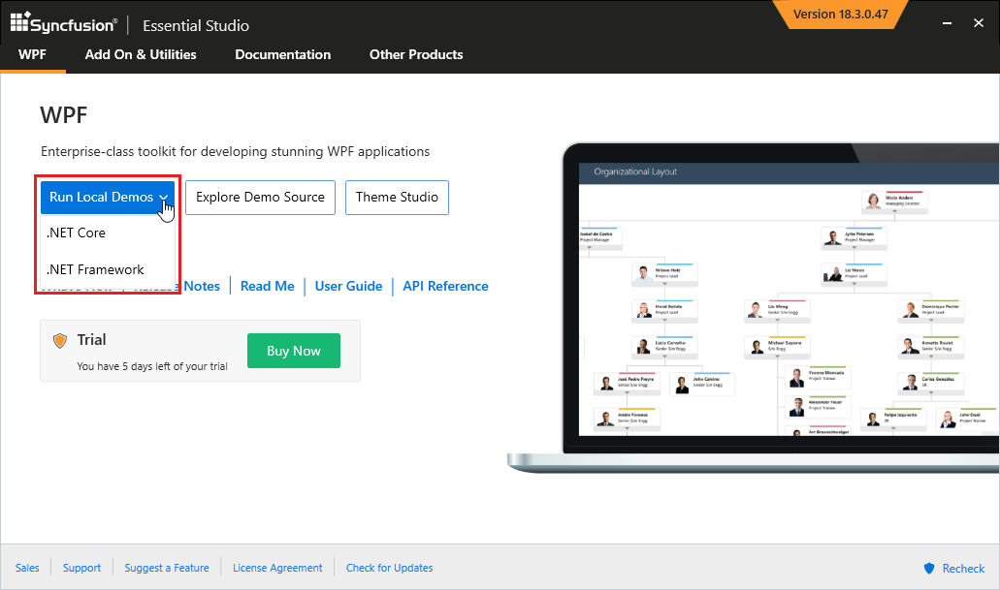
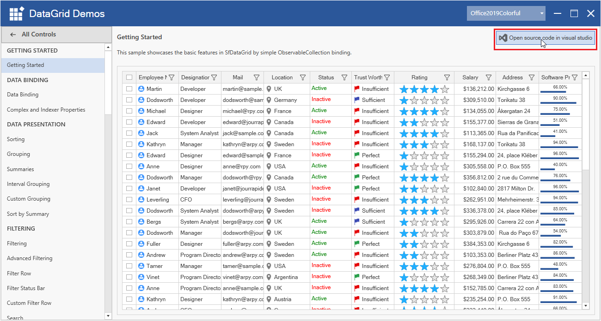

# Featured Samples for Syncfusion WPF Controls

## Syncfusion WPF Controls Panel

To explore Syncfusion WPF controls and components, Open `Syncfusion WPF Controls Panel` by searching it from start and open. 

In another way, Open the Control Panel from the following installed location,

C:\Program Files (x86)\Syncfusion\Essential Studio\WPF\{{ site.releaseversion }}\Infrastructure\Launcher\Syncfusion WPF Control Panel.exe

N> In above section, Latest Essential Studio version details has been provided. You can refer installed Essential Studio version instead of mentioned version.

## WPF Sample Browser

To explore the locally installed demos, click `Run Local Demos` and select either `.NET Core` or `.NET FrameWork` which will open `WPF Sample Browser`.

## Offline Samples

The Offline samples are available in the following installed location where you can make changes and further exploration of controls.

C:\Users\Public\Documents\Syncfusion\WPF\{{ site.releaseversion }}\

The offline samples can also be explored directly from `Syncfusion WPF Sample Browser` and opened in Visual Studio by run the required sample and click `Open source code in visual studio` button.

### Offline Showcase Samples

To explore any individual showcase sample from `Syncfusion WPF Sample Browser`, Click `Explore Demo Source` and navigate to `showcase` folder.

N> To run the individual control demos, please refer the instruction from [Running Individual Control Demos](https://github.com/syncfusion/wpf-demos#running-individual-control-demos). 

## Online Samples

* Download and install `.NetCore` demos from [App Center](https://install.appcenter.ms/orgs/syncfusion-demos/apps/wpf-demos/distribution_groups/release).
* Download and install `.Net Framework` demos from [Microsoft Store](https://www.microsoft.com/en-us/p/syncfusion-wpf-controls-examples/9n99kdhrff6g?activetab=pivot:overviewtab).

## Download demos from online (Clone from github repository)

You can explore Syncfusion WPF controls using [GitHub WPF demos](https://github.com/syncfusion/wpf-demos) where all wpf demos are configured using `NuGet` to run without installing Syncfusion WPF Studio.

### Download showcase demos from online

You can explore showcase demos from [GitHub WPF demos](https://github.com/syncfusion/wpf-demos/tree/master/showcase).
